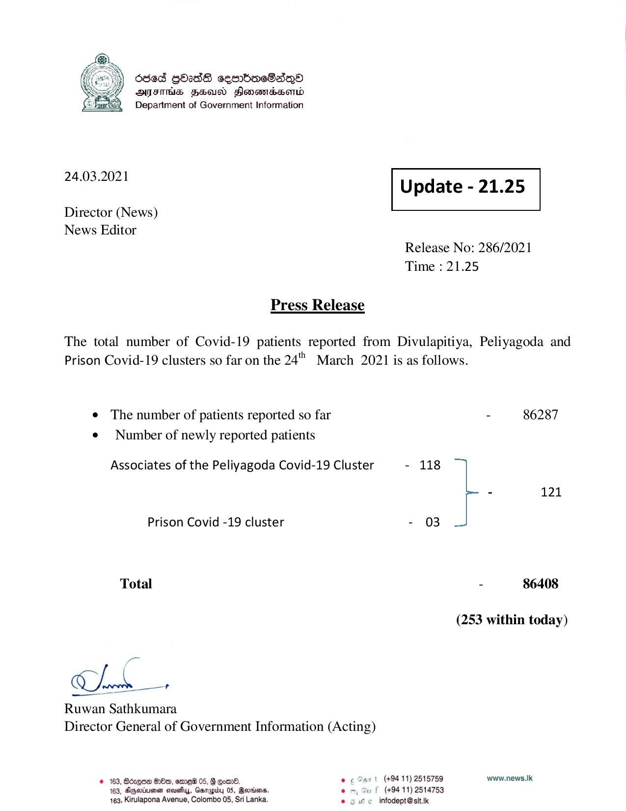

# Press Release - 2021.03.24 
Key: c10cd51ee75bce695ec541ddc2383326 

---
```
686d gOsdS sembcSaqQa
AMITHS HEU) Honors
Department of Government Information

 

 

24.03.2021 Update - 21.25

 

 

 

Director (News)
News Editor
Release No: 286/2021

Time : 21.25

Press Release
The total number of Covid-19 patients reported from Divulapitiya, Peliyagoda and

Prison Covid-19 clusters so far on the 24" March 2021 is as follows.

¢ The number of patients reported so far - 86287
¢ Number of newly reported patients

Associates of the Peliyagoda Covid-19 Cluster - 118
- 121
Prison Covid -19 cluster - 03
Total - 86408
(253 within today)

Ch

Ruwan Sathkumara
Director General of Government Information (Acting)

#163, B6zQ6@ G80, exsre8 05, G Qomr8. © ¢ Our | (494.11) 2515759 www.news.Ik
163, Besotusnen sousuy, Garapby 05, Bevmiens. . wu f (+94 11) 2514753
163, Kirulapona Avenue, Colombo 05, Sri Lanka. e infodept@sit.k

    

```
