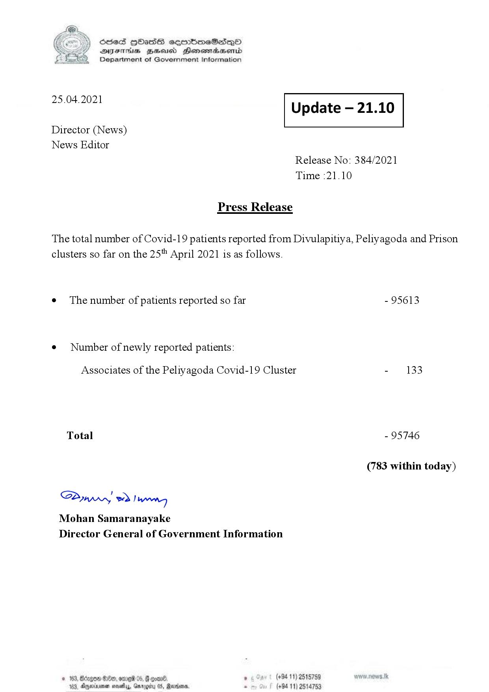

# Press Release - 2021.04.25 
Key: c12cb8235ecdd43fb87f6963b0ac5b20 

---
```
S) ScseS HOasdS cerrbmeSdQo
SVsThis geod Henssnadasombd
Department of Government Information

 

 

25.04.2021 Update — 21.10

 

 

 

Director (News)

News Editor
Release No: 384/2021
Time :21.10

Press Release
The total number of Covid-19 patients reported from Divulapitiya, Peliyagoda and Prison
clusters so far on the 25" April 2021 is as follows.

e The number of patients reported so far - 95613

¢ Number of newly reported patients:

Associates of the Peliyagoda Covid-19 Cluster - 133
Total - 95746
(783 within today)

Saw > Danny
Mohan Samaranayake
Director General of Government Information

$100, 02216 06, 8 qoan® ’ (+94 11) 2515759
103, Ayminumen neva, Garogty 05, Marden, 2 (+94 11) 2514753

 

```
