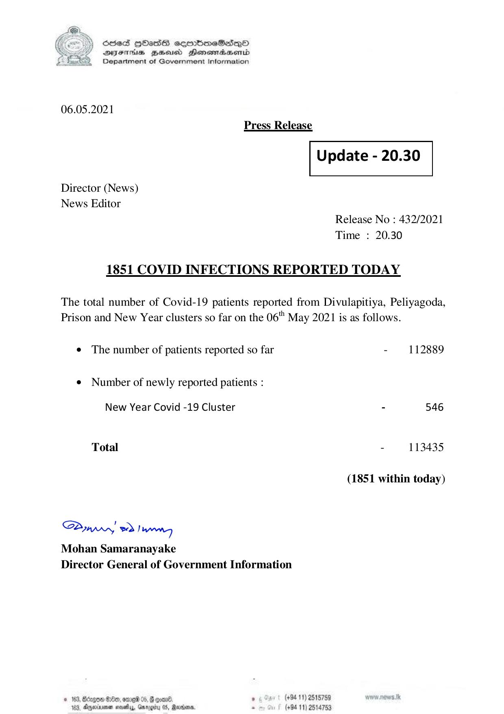

# Press Release - 2021.05.06 
Key: c17483c78e37a6afa574d1a29aa99347 

---
```
) ScdeS HOadS cermbmeSsdQo
SUES Zeid Henesrdaembd
Department of Government Information

 

06.05.2021
Press Release

 

Update - 20.30

 

 

 

Director (News)
News Editor

Release No : 432/2021
Time : 20.30

1851 COVID INFECTIONS REPORTED TODAY

The total number of Covid-19 patients reported from Divulapitiya, Peliyagoda,
Prison and New Year clusters so far on the 06" May 2021 is as follows.

¢ The number of patients reported so far - 112889

¢ Number of newly reported patients :

New Year Covid -19 Cluster - 546

Total - 113435
(1851 within today)
Saw eo) wenn

Mohan Samaranayake
Director General of Government Information

© 163, Bcrgow $80, omreid 05,  coan® , (+94 11) 2515789
183, Aperinsna sasety, Gnrogiry 05, Racers - (+94 11) 2514753

```
