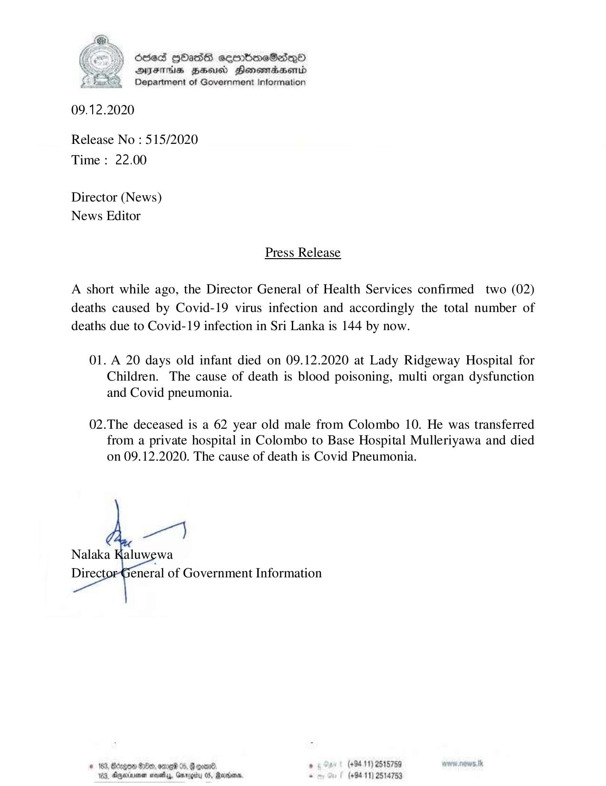

# Press Release - 2020.12.09 - Covid 19 infection deaths rises to 144 
Key: c17d28c9e61311e2e375df8bbf37295e 

---
```
Osed Hbass seenboaeSasqo
DFAS HEU Honomrdbserntd
Department of Government Information

 

09.12.2020

Release No : 515/2020
Time : 22.00

Director (News)
News Editor

Press Release

A short while ago, the Director General of Health Services confirmed two (02)
deaths caused by Covid-19 virus infection and accordingly the total number of
deaths due to Covid-19 infection in Sri Lanka is 144 by now.

01. A 20 days old infant died on 09.12.2020 at Lady Ridgeway Hospital for
Children. The cause of death is blood poisoning, multi organ dysfunction
and Covid pneumonia.

02.The deceased is a 62 year old male from Colombo 10. He was transferred
from a private hospital in Colombo to Base Hospital Mulleriyawa and died
on 09.12.2020. The cause of death is Covid Pneumonia.

 

. (+84 11) 2515759 w.nows.tk
163, Anwar ney, Gurogbu 05, Ranson. “ (+9411) 2514753

* 163, Bcngon Boe, omed , G coal.

 

```
