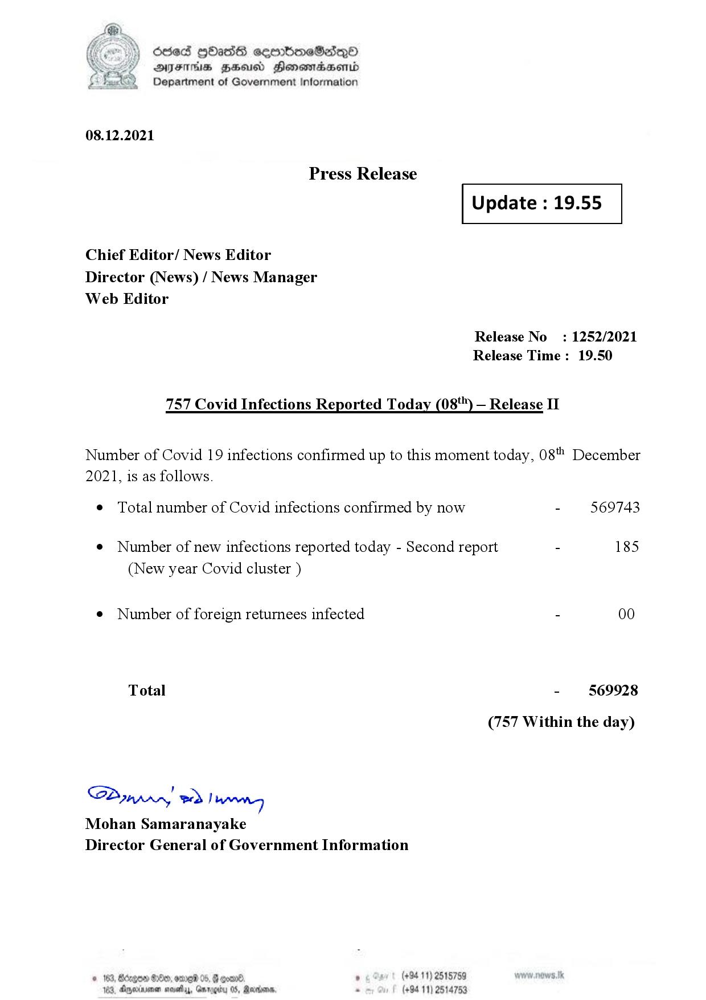

# Press Release - 2021.12.08 - Covid 19 Infection Report 
Key: c230ab52c70d34015ec543ce1d0067ef 

---
```
dosed GOass eemmbmeSadepO
DFS BHU Honswnradasentd
Department of Government Information

 

 

08.12.2021

Press Release

 

Update : 19.55

 

 

 

Chief Editor/ News Editor
Director (News) / News Manager
Web Editor

Release No: 1252/2021
Release Time : 19.50

757 Covid Infections Reported Today (08*") — Release II

Number of Covid 19 infections confirmed up to this moment today, 08" December
2021, is as follows.

¢ Total number of Covid infections confirmed by now - 569743

¢ Number of new infections reported today - Second report - 185
(New year Covid cluster )

¢ Number of foreign returnees infected - 00
Total - 569928
(757 Within the day)

SP nprrn wd Ianwng
Mohan Samaranayake
Director General of Government Information

(+94 11) 2515759
(+94 11) 2514753

GOD 100, omg 05
Doyerinsonen snevetyy, Garo

   

```
