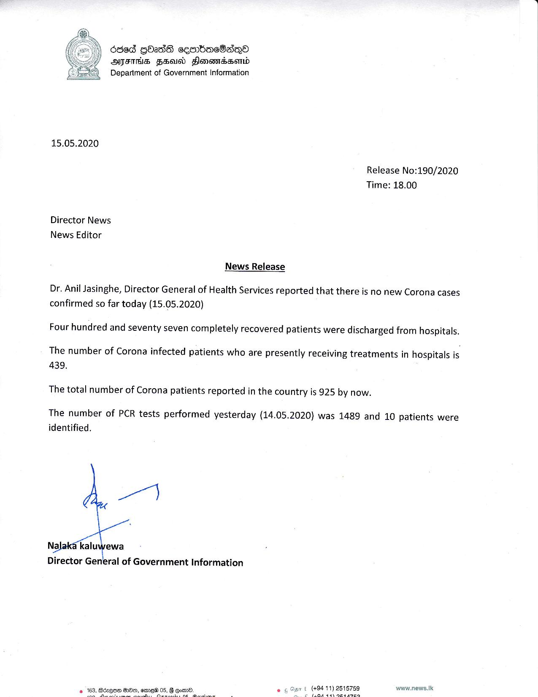

# Press Release - 2020.05.15 - Total number of Corona patients reported in the country is 925 by now 
Key: c23c206d324c18f864d7ff35f2986698 

---
```
6365 GhadsS cesmbacBsqne
AIFS FEA Flonomnabsomd
Department of Government Information

 

15.05.2020

Release No:190/2020
Time: 18.00

Director News
News Editor

News Release

Dr. Anil Jasinghe, Director General of Health Services reported that there is no new Corona cases
confirmed so far today (15.05.2020)

Four hundred and seventy seven completely recovered patients were discharged from hospitals.

The number of Corona infected patients who are presently receiving treatments in hospitals is
439,

The total number of Corona patients reported in the country is 925 by now.

The number of PCR tests performed yesterday (14.05.2020) was 1489 and 10 patients were
identified.

 

Director General of Government Information

t (494-11) 2515759 www.news.1k

Fe pera

   

```
