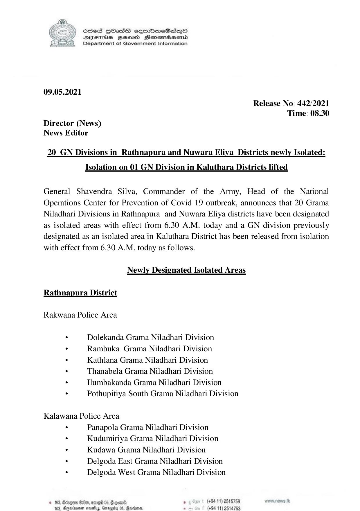

# Press Release - 2021.05.09 - 20 GN Divisions in Rathnapura and Nuwara Eliya Districts newly Isolated:Isolation on 01 GN Division in Kaluthara District lifted 
Key: c280fbd94c3d4a8dbeb79a14129de9a3 

---
```
S865 HOasS eqrmbmeSs—oO
DFTs BHousd Henombaend
Department of Government Information

 

09.05.2021

Release No: 442/2021
Time: 08.30
Director (News)
News Editor

20_GN Divisions in _Rathnapura and Nuwara Eliya Districts newly Isolated:

Isolation on 01 GN Division in Kaluthara Districts lifted

General Shavendra Silva, Commander of the Army, Head of the National
Operations Center for Prevention of Covid 19 outbreak, announces that 20 Grama
Niladhari Divisions in Rathnapura and Nuwara Eliya districts have been designated
as isolated areas with effect from 6.30 A.M. today and a GN division previously
designated as an isolated area in Kaluthara District has been released from isolation
with effect from 6.30 A.M. today as follows.

Newly Designated Isolated Areas

Rathnapura District

Rakwana Police Area

. Dolekanda Grama Niladhari Division

. Rambuka Grama Niladhari Division

. Kathlana Grama Niladhari Division

. Thanabela Grama Niladhari Division

. Tlumbakanda Grama Niladhari Division

: Pothupitiya South Grama Niladhari Division

Kalawana Police Area

. Panapola Grama Niladhari Division
s Kudumiriya Grama Niladhari Division
. Kudawa Grama Niladhari Division

* Delgoda East Grama Niladhari Division
. Delgoda West Grama Niladhari Division

  

© 163, Bdzgom $80, ome 05 , (+94 11) 2515759
183, Ageiuen sah, Gargdy 05, Radme. s (494 11) 2514753

```
