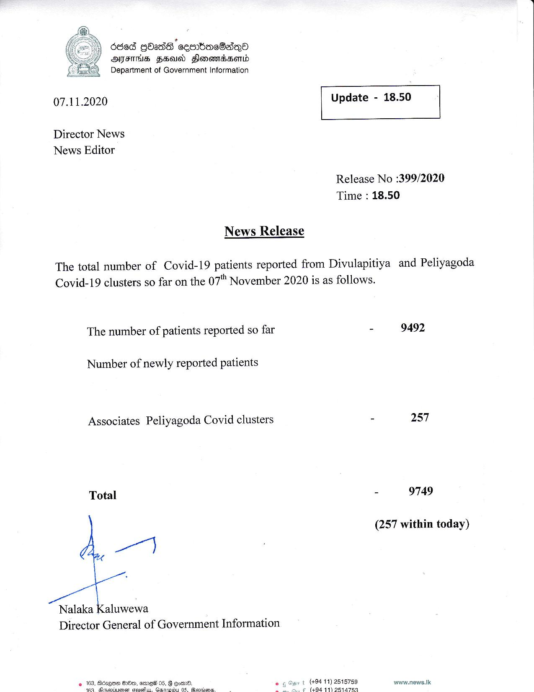

# Press Release - 2020.11.07 
Key: c287a90a66fd26978dd69ae94d04336f 

---
```
.
S65 HOadS ceenbaeBa—QoO
ATES SFU) FlonomsBorid
Department of Government Information

 

 

07.11.2020 Update - 18.50

 

 

 

Director News
News Editor

Release No :399/2020
Time : 18.50

News Release
The total number of Covid-19 patients reported from Divulapitiya and Peliyagoda
Covid-19 clusters so far on the 07" November 2020 is as follows.
The number of patients reported so far - 9492

Number of newly reported patients

Associates Peliyagoda Covid clusters - 257
Total - 9749
(257 within today)

on]

x

Nalaka Kaluwewa
Director General of Government Information

(+94 11) 2515759 www.news.Ik
4.9444) DB4A759

   

—

 

```
