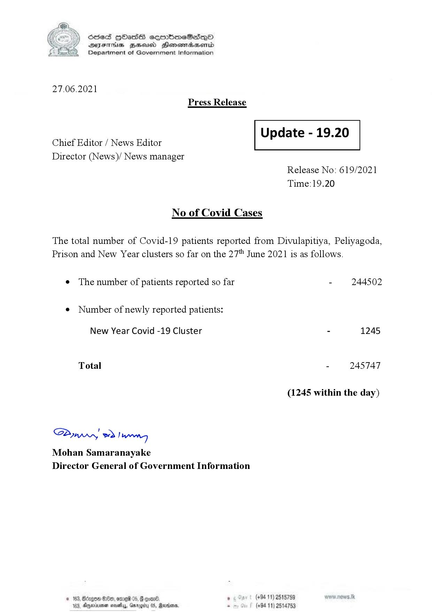

# Press Release - 2021.06.27 
Key: c2bda60a9ac1db99bb601e9b4cd42732 

---
```
S) ScseS HOasdS cerrbmeSdQo
DFTs BHEosd Henewtaeasernid
Department of Government Information

 

27.06.2021
Press Release

 

Update - 19.20

 

 

Chief Editor / News Editor
Director (News)/ News manager

 

Release No: 619/2021
Time:19.20

No of Covid Cases

The total number of Covid-19 patients reported from Divulapitiya, Peliyagoda,
Prison and New Year clusters so far on the 27" June 2021 is as follows.

e The number of patients reported so far - 244502
¢ Number of newly reported patients:

New Year Covid -19 Cluster - 1245

- 245747

Total

(1245 within the day)

Saw 2) wn

Mohan Samaranayake
Director General of Government Information

$200, on199 0 (+94 11) 2515759
(+84 11) 2514753

Anwinma noe, Garey 05, Radars

 

```
