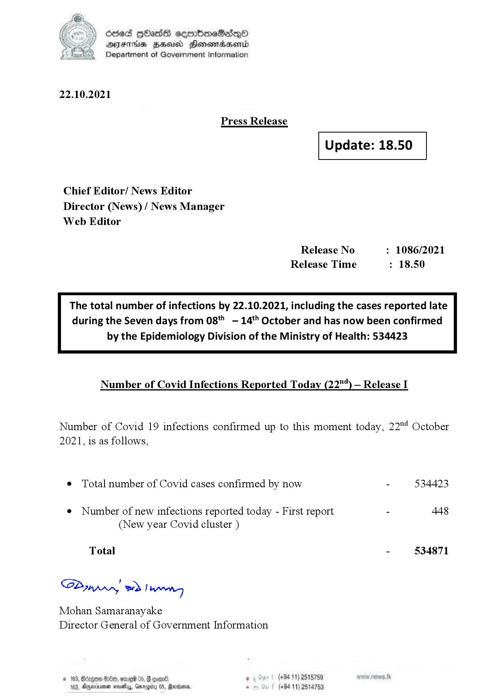

# Press Release - 2021.10.22 
Key: c300c1cf1d5f01733cadcc98e4471936 

---
```
6863 GOasds sembmeSadqQo
AIFS HSA Honomasentd
Department of Government Information

 

22.10.2021

Press Release

 

Update: 18.50

 

 

 

Chief Editor/ News Editor
Director (News) / News Manager
Web Editor

Release No : 1086/2021
Release Time : 18.50

The total number of infections by 22.10.2021, including the cases reported late
during the Seven days from 08" —- 14'' October and has now been confirmed

by the Epidemiology Division of the Ministry of Health: 534423

 

Number of Covid Infections Reported Today (22"‘) — Release I

Number of Covid 19 infections confirmed up to this moment today, 22" October
2021, is as follows,

¢ Total number of Covid cases confirmed by now - 534423

¢ Number of new infections reported today - First report - 448
(New year Covid cluster )

Total - 534871

SP ynprn! wd! wong

Mohan Samaranayake
Director General of Government Information

 

(+94 11) 2515759

2, dgexninen seats, Gmrogity 0S, Rarions, . (+94 11) 2514753

  

```
