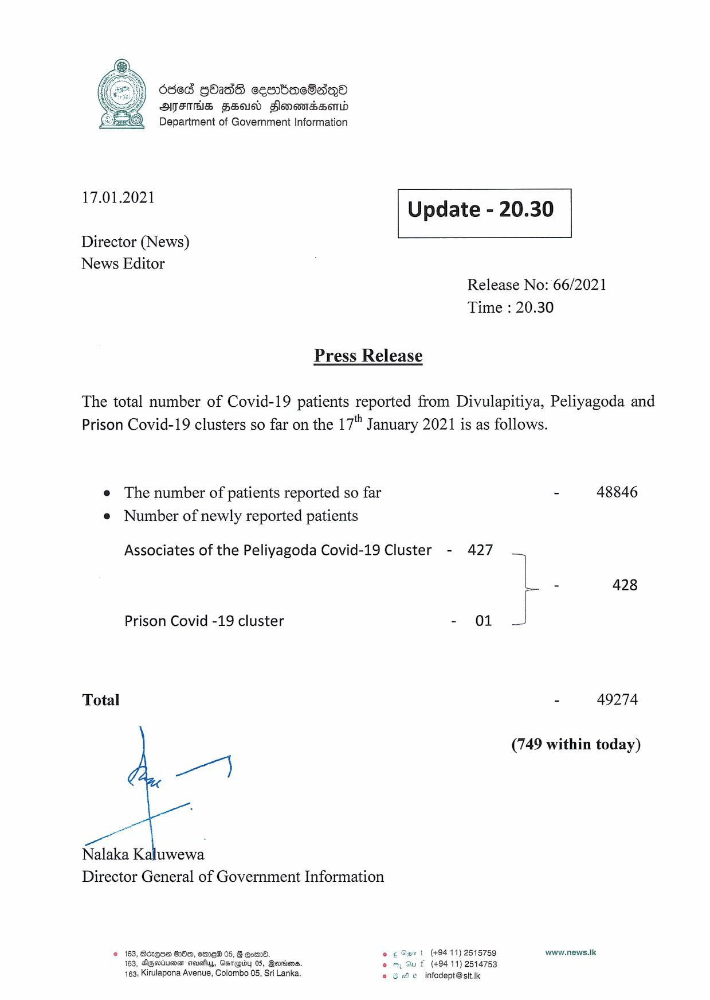

# Press Release - 2021.01.17 
Key: c50332411497e555d79148d9f4d6d3e6 

---
```
680d GOasE cesrbac8aqQo
AFTHS FSU Sonoda
Department of Government Information

 

 

17.01.2021 Update - 20.30

 

 

 

Director (News)

News Editor
Release No: 66/2021
Time : 20.30

Press Release

The total number of Covid-19 patients reported from Divulapitiya, Peliyagoda and
Prison Covid-19 clusters so far on the 17" January 2021 is as follows.

e The number of patients reported so far - 48846
e Number of newly reported patients

Associates of the Peliyagoda Covid-19 Cluster - 427
- 428

Prison Covid -19 cluster - 01

Total - 49274

(749 within today)

wry}

Nalaka Kaluwewa
Director General of Government Information

© 163, Bcxqow GHe, mre 05, G Gorn. © ¢ Opn | (+9411) 2515759 www.news.lk
163, Agerisumsr sauayy, Ganagidy 05, Berries, eo 7% Su f (+9411) 2514753
163, Kirulapona Avenue, Colombo 05, Sri Lanka, eS We infodept@sit.k

```
