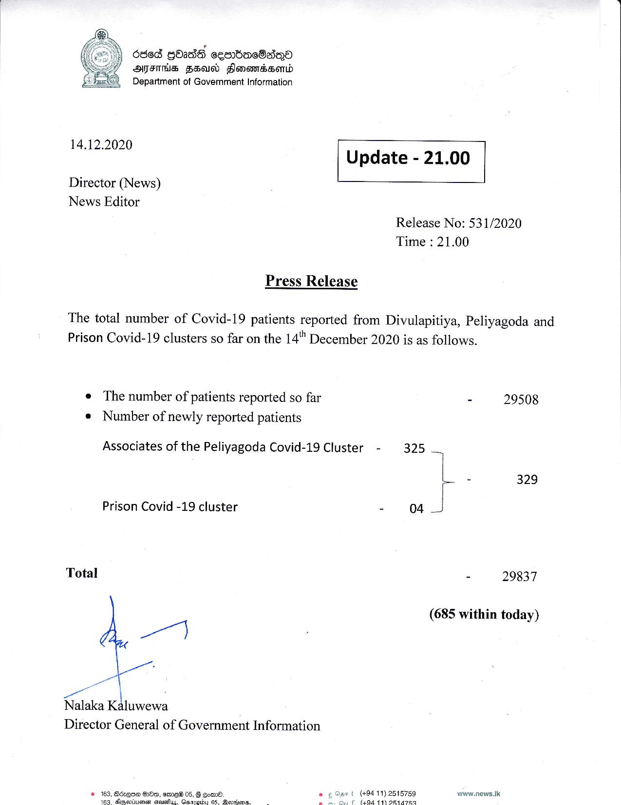

# Press Release - 2020.12.14 
Key: c669c62fca9a81e04b48b7ada0d62e27 

---
```
686d GOass ceenbaeSaien®
OMFS Fa Fonemssomd
Department of Government Information

  

5

 

14.12.2020 Update - 21.00

 

 

 

Director (News)

News Editor
Release No: 531/2020
Time : 21.00

Press Release

The total number of Covid-19 patients reported from Divulapitiya, Peliyagoda and
Prison Covid-19 clusters so far on the 14" December 2020 is as follows.

e The number of patients reported so far - 29508
e Number of newly reported patients
Associates of the Peliyagoda Covid-19 Cluster - 325 _..
L 2 329
Prison Covid -19 cluster > 04 J
Total - 29837

(685 within today)

 

Nalaka Kaluwewa
Director General of Government Information

1 (+94 11) 2515759 www.news.k

© 163, Bdzqoe Gm, emai 05, 8 @ome.
¢ (40499) OR Va7Ra

wri dinuaseer-ncieic Dace Oe lie ee

 

 

```
