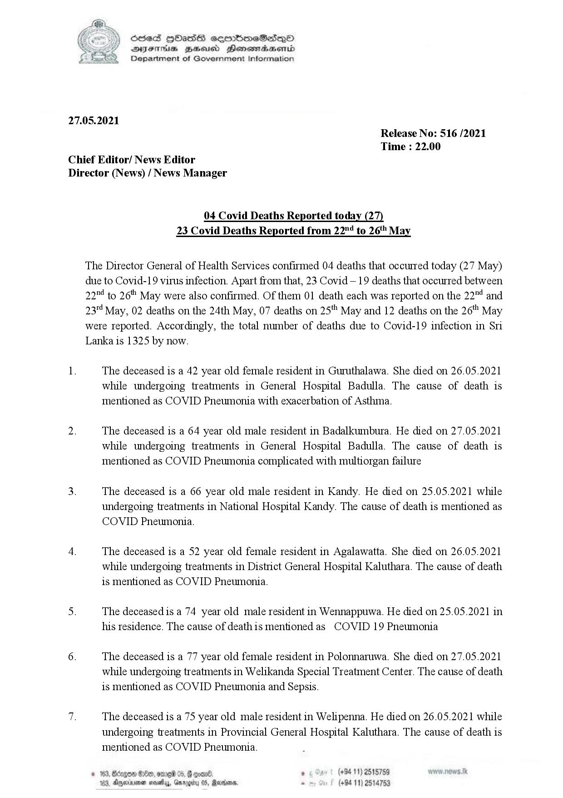

# Press Release - 2021.05.27 - Covid 19 infection deaths 
Key: c68349e46e3e66e65bf0e15a9f4b600e 

---
```
 

(Ke S) ScieS HOasS ceerboeSdQo
Y syentie gesusd Henesmdasend
©) Department of Government Information

 

27.05.2021
Release No: 516 /2021
Time : 22.00

Chief Editor/ News Editor

Director (News) / News Manager

04 Covid Deaths Reported today (27)
23 Covid Deaths Reported from 22"! to 26 May

The Director General of Health Services confirmed 04 deaths that occurred today (27 May)
due to Covid-19 virus infection. Apart from that, 23 Covid—19 deaths that occurred between
22"4 to 26"" May were also confirmed. Of them 01 death each was reported on the 22"4 and
23" May, 02 deaths on the 24th May, 07 deaths on 25" May and 12 deaths on the 26" May
were reported. Accordingly, the total number of deaths due to Covid-19 infection in Sri
Lanka is 1325 by now.

1. The deceased is a 42 year old female resident in Guruthalawa. She died on 26.05.2021
while undergoing treatments in General Hospital Badulla. The cause of death is
mentioned as COVID Pneumonia with exacerbation of Asthma.

2. The deceased is a 64 year old male resident in Badalkumbura. He died on 27.05.2021
while undergoing treatments in General Hospital Badulla. The cause of death is
mentioned as COVID Pneumonia complicated with multiorgan failure

3. The deceased is a 66 year old male resident in Kandy. He died on 25.05.2021 while
undergoing treatments in National Hospital Kandy. The cause of death is mentioned as
COVID Pneumonia.

4. The deceased is a 52 year old female resident in Agalawatta. She died on 26.05.2021
while undergoing treatments in District General Hospital Kaluthara. The cause of death
is mentioned as COVID Pneumonia.

5. The deceasedis a 74 year old male resident in Wennappuwa. He died on 25.05.2021 in
his residence. The cause of deathis mentioned as COVID 19 Pneumonia

6. The deceased is a 77 year old female resident in Polonnaruwa. She died on 27.05.2021
while undergoing treatments in Welikanda Special Treatment Center. The cause of death
is mentioned as COVID Pneumonia and Sepsis.

Te The deceased is a 75 year old male resident in Welipenna. He died on 26.05.2021 while
undergoing treatments in Provincial General Hospital Kaluthara. The cause of death is
mentioned as COVID Pneumonia.

  
 

. (+94 11) 2515759
(+94 11) 2514753

GOD SOO, ome 05, F
53, Anyerinienan savetas, Garo

 

```
