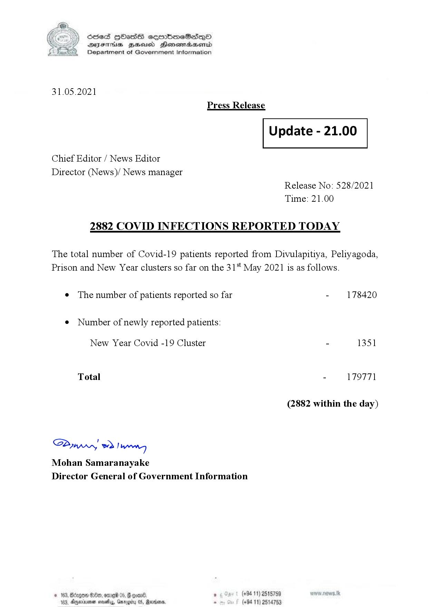

# Press Release - 2021.05.31 - Covid 19 infection report 
Key: c69c4ac0f723c03e5c37d9d726143427 

---
```
(6 S) ScseS HOasdS cerrbmeSdQo
DFTs BHEosd Henewtaeasernid
Department of Government Information

 

31.05.2021
Press Release

 

Update - 21.00

 

 

 

Chief Editor / News Editor

Director (News)/ News manager
Release No: 528/2021
Time: 21.00

2882 COVID INFECTIONS REPORTED TODAY

The total number of Covid-19 patients reported from Divulapitiya, Peliyagoda,
Prison and New Year clusters so far on the 31 May 2021 is as follows.

e The number of patients reported so far - 178420

¢ Number of newly reported patients:

New Year Covid -19 Cluster - 1351
Total - 179771
(2882 within the day)

Saw 2) won,
Mohan Samaranayake
Director General of Government Information

© 163, Borgen 0, ome 05, onan , (+94 11) 2515759
103, Ayminumen neal, Garogity 05, Marden . (+94 11) 2514753

 

```
