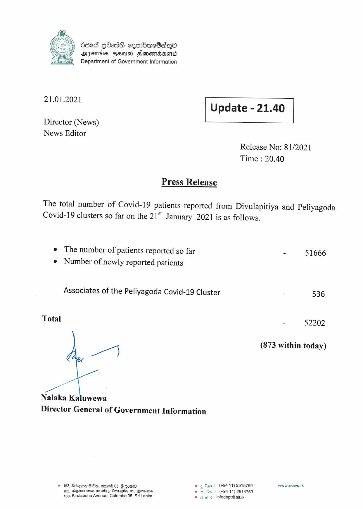

# Press Release - 2021.01.21 
Key: c6b48e5a99043a11957f3b0a8ef89ecd 

---
```
ded GOadS cembacSaiqQoa
ATES FSU FlomomesHsomd
Department of Government Information

 

 

21.01.2021 Update - 21.40

 

 

 

Director (News)
News Editor

Release No: 81/2021
Time : 20.40

Press Release

The total number of Covid-19 patients reported from Divulapitiya and Peliyagoda
Covid-19 clusters so far on the 21" January 2021 is as follows.

e The number of patients reported so far - 51666
¢ Number of newly reported patients

Associates of the Peliyagoda Covid-19 Cluster - 536

Total - 52202

el (873 within today)

a

ae
Nalaka Kaluwewa

Director General of Government Information

© 163, Boequa GO, ere 05, G Come. © ¢ Sant (+9411) 2515759 www.news.lk
163, SGHiuss stares, Gasrepioy 05, Beroienss uf (494-11) 2514753
163, Kirulapona Avenue, Colombo 05, Si Lanka. © owe infodept@sitik

 

```
