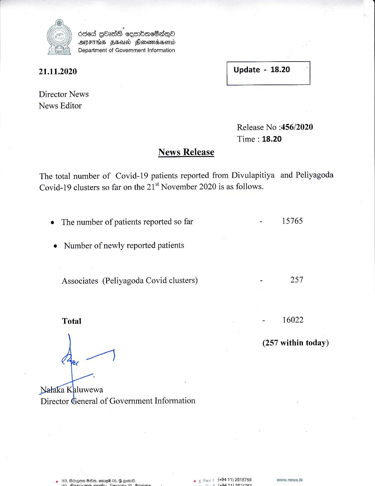

# Press Release - 2020.11.21 
Key: c79c293cb7484aeab94a8f6673cb4f56 

---
```
 
  
 

} dded GOadS seenbacSaQe®
AIIHS FSD Sones)

& Department of Government Information

 

21.11.2020 Update - 18.20

 

 

 

Director News
News Editor

Release No :456/2020
Time : 18.20

News Release

The total number of Covid-19 patients reported from Divulapitiya and Peliyagoda
Covid-19 clusters so far on the 21" November 2020 is as follows.

e The number of patients reported so far - 15765

© Number of newly reported patients

Associates (Peliyagoda Covid clusters) - 257

Total - 16022

(257 within today)

 

Director General of Government Information

+94 11) 2515759 waww.news.tk
haa hak eee

    

 

```
