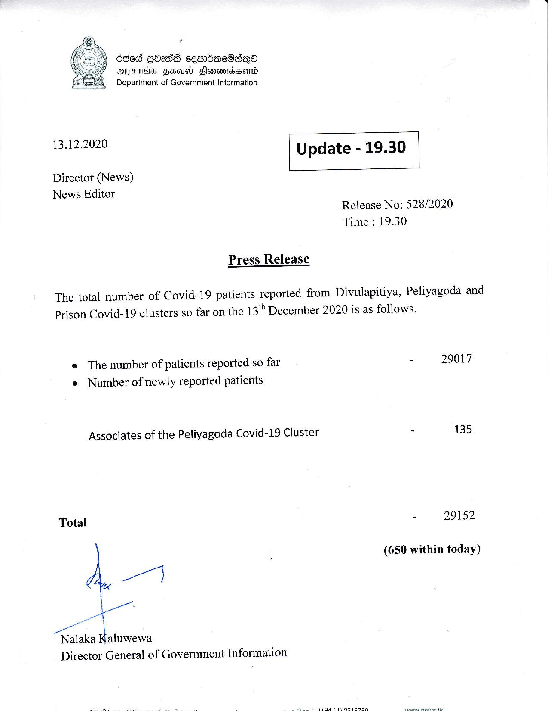

# Press Release - 2020.12.13 
Key: c807d60fac41474576119ae9fc7edf1f 

---
```
6863 GOadS ceenbacBadqQa
AJFIHS FH Honondsonrd
Department of Government Information

 

 

13.12.2020 Update - 19.30

 

 

 

Director (News)
News Editor

Release No: 528/2020
Time : 19.30

Press Release

The total number of Covid-19 patients reported from Divulapitiya, Peliyagoda and
Prison Covid-19 clusters so far on the 13" December 2020 is as follows.

¢ The number of patients reported so far
e Number of newly reported patients

Associates of the Peliyagoda Covid-19 Cluster

Total
“ o—
ae af \
Nalaka Palwewa

Director General of Government Information

 

ey 2 eae a

- 29017

2 135

- 29152

(650 within today)

 

 

```
