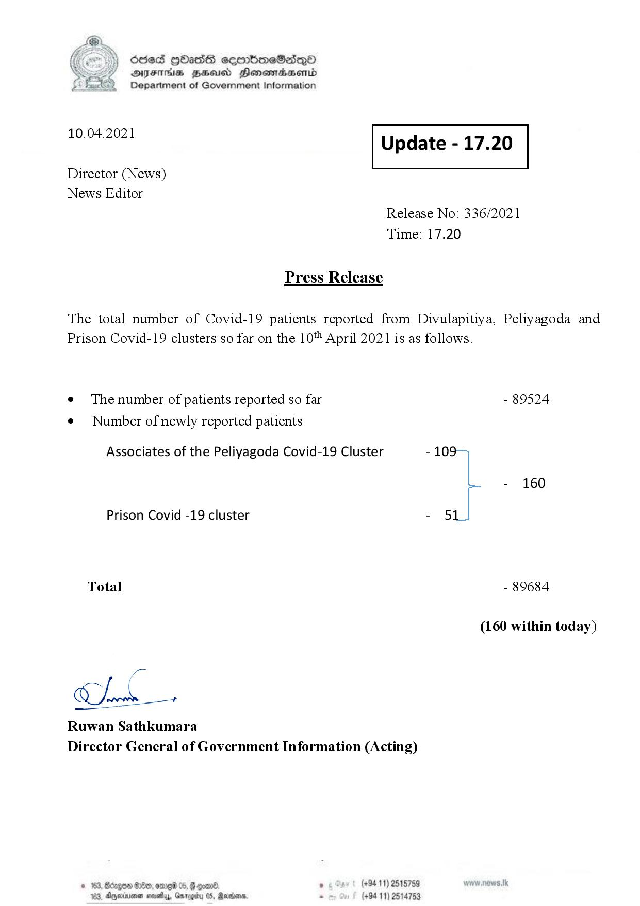

# Press Release - 2021.04.10 
Key: c85bc272a6dad331ff81cdba240f729c 

---
```
\) O63 GOadS ceortimeSzdQO
AIFS BHU Henewmadasentd
Department of Government Information

 

 

10.04.2021 Update - 17.20

 

 

 

Director (News)

News Editor
Release No: 336/2021
Time: 17.20

Press Release

The total number of Covid-19 patients reported from Divulapitiya, Peliyagoda and
Prison Covid-19 clusters so far on the 10" April 2021 is as follows.

e¢ The number of patients reported so far - 89524

¢ Number of newly reported patients

Associates of the Peliyagoda Covid-19 Cluster - 109
- 160
Prison Covid -19 cluster - 51
Total - 89684
(160 within today)

Chk

Ruwan Sathkumara
Director General of Government Information (Acting)

© 163, Bizgoe 89, omre 05, & coan® , (+94 11) 2515759
183, Dyminvemen novels, arog 05, Marden. . (+94 11) 2514753

 

```
