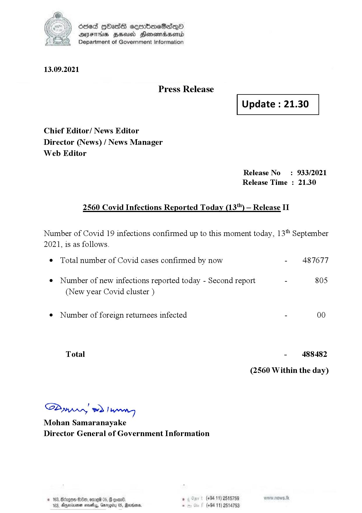

# Press Release - 2021.09.13  - Covid 19 Infection Report 
Key: c888c3897c49f81fe0677a20c6a6117a 

---
```
dosed GOass eemmbmeSadepO
DFS BHU Honswnradasentd
Department of Government Information

 

 

13.09.2021

Press Release

Chief Editor/ News Editor
Director (News) / News Manager
Web Editor

 

 

Update : 21.30

 

 

Release No: 933/2021
Release Time : 21.30

2560 Covid Infections Reported Today (13") — Release II

Number of Covid 19 infections confirmed up to this moment today, 13" September

2021, is as follows.

¢ Total number of Covid cases confirmed by now

¢ Number of new infections reported today - Second report

(New year Covid cluster )

¢ Number of foreign returnees infected

Total

SP nprrn wd Ianwng
Mohan Samaranayake
Director General of Government Information

 

. (+94 11) 2515759
(+94 11) 2514753

- 487677

805

- 488482
(2560 Within the day)

```
