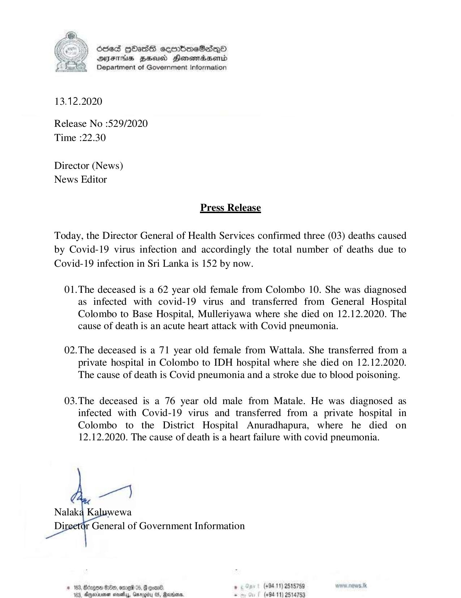

# Press Release - 2020.12.13 - Covid 19 infection deaths rises to 152 
Key: c894ffbab663c37ec84e98788648dfe4 

---
```
6565 HHasIs sembmeSdqQo
DAFITUs BHU Honomadbasentd
Department of Government Information

  

 

13.12.2020

Release No :529/2020
Time :22.30

Director (News)
News Editor

Press Release

Today, the Director General of Health Services confirmed three (03) deaths caused
by Covid-19 virus infection and accordingly the total number of deaths due to
Covid-19 infection in Sri Lanka is 152 by now.

01.The deceased is a 62 year old female from Colombo 10. She was diagnosed
as infected with covid-19 virus and transferred from General Hospital
Colombo to Base Hospital, Mulleriyawa where she died on 12.12.2020. The
cause of death is an acute heart attack with Covid pneumonia.

02.The deceased is a 71 year old female from Wattala. She transferred from a
private hospital in Colombo to IDH hospital where she died on 12.12.2020.
The cause of death is Covid pneumonia and a stroke due to blood poisoning.

03.The deceased is a 76 year old male from Matale. He was diagnosed as
infected with Covid-19 virus and transferred from a private hospital in
Colombo to the District Hospital Anuradhapura, where he died on
12.12.2020. The cause of death is a heart failure with covid pneumonia.

ae

Nalaka Kaluwewa
Di r General of Government Information

# 183, Bago 8c, oma 05, Goomn® , (+9411) 2515759
eisvenan stevetlyy, Gmrogiby OS, Rarisans. s (494-11) 2514753

 

```
