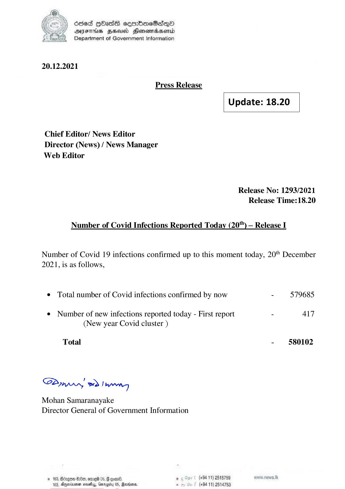

# Press Release - 2021.12.20 
Key: c95d0c66234b70ac3bc9eb3121770279 

---
```
) dcded QhasS ceerbneSdiqQo
DFTs HH Honsomadsenid
Department of Government Information

 

 

20.12.2021
Press Release
Update: 18.20
Chief Editor/ News Editor
Director (News) / News Manager
Web Editor

Release No: 1293/2021
Release Time:18.20

Number of Covid Infections Reported Today (20) — Release I

Number of Covid 19 infections confirmed up to this moment today, 20" December
2021, is as follows,

© Total number of Covid infections confirmed by now - 579685

¢ Number of new infections reported today - First report - Al7
(New year Covid cluster )

Total - 580102

Sa mprr wd! bong

Mohan Samaranayake
Director General of Government Information

 

© 163, Bdzgoe $10, ome 05, @ gomn® , (+94 11) 2518759
163. Agywinmen sess, Gnroerty 05, arbors. . (+94 11) 2514753

```
