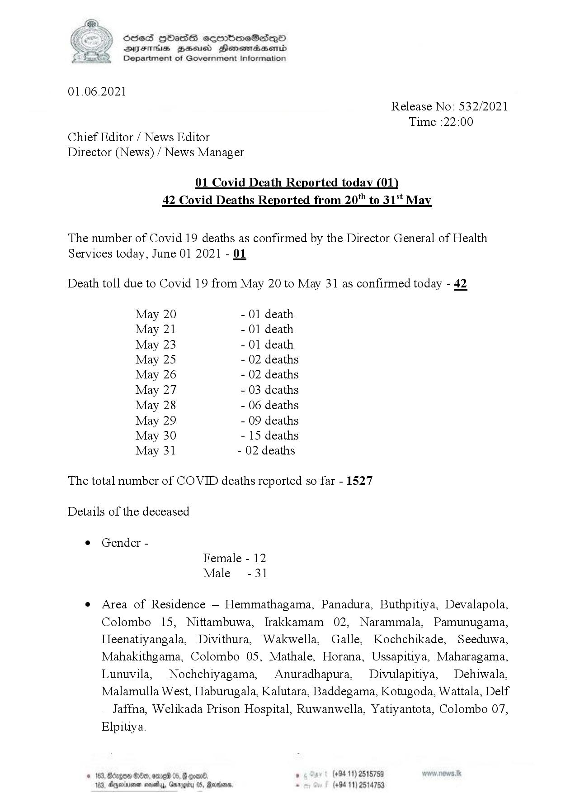

# Press Release - 2021.06.01 - Covid 19 infection deaths 
Key: c9cdc66d665af32c34c0aef8b9123fd9 

---
```
| Scied HObasS sermimeSesqQoO
SVYsEThs BHsusd Henemadasemid
Department of Government Information

 

01.06.2021
Release No: 532/2021
Time :22:00
Chief Editor / News Editor
Director (News) / News Manager

01 Covid Death Reported today (01
42 Covid Deaths Reported from 20" to 31°t May

The number of Covid 19 deaths as confirmed by the Director General of Health
Services today, June 01 2021 - OL

Death toll due to Covid 19 from May 20 to May 31 as confirmed today - 42

May 20 - 01 death
May 21 - 01 death
May 23 - 01 death
May 25 - 02 deaths
May 26 - 02 deaths
May 27 - 03 deaths
May 28 - 06 deaths
May 29 - 09 deaths
May 30 - 15 deaths
May 31 - 02 deaths

The total number of COVID deaths reported so far - 1527
Details of the deceased

© Gender -
Female - 12
Male -31

e Area of Residence — Hemmathagama, Panadura, Buthpitiya, Devalapola,
Colombo 15, Nittambuwa, Irakkamam 02, Narammala, Pamunugama,
Heenatiyangala, Divithura, Wakwella, Galle, Kochchikade, Seeduwa,
Mahakithgama, Colombo 05, Mathale, Horana, Ussapitiya, Maharagama,
Lunuvila, Nochchiyagama, Anuradhapura, Divulapitiya, Dehiwala,
Malamulla West, Haburugala, Kalutara, Baddegama, Kotugoda, Wattala, Delf
— Jaffna, Welikada Prison Hospital, Ruwanwella, Yatiyantota, Colombo 07,
Elpitiya.

one . (+94 11) 2515759
mosis, Garggity 05, Reorder, - (+94 11) 2514753

 

© 163, Bdegos

103, movin

 

```
