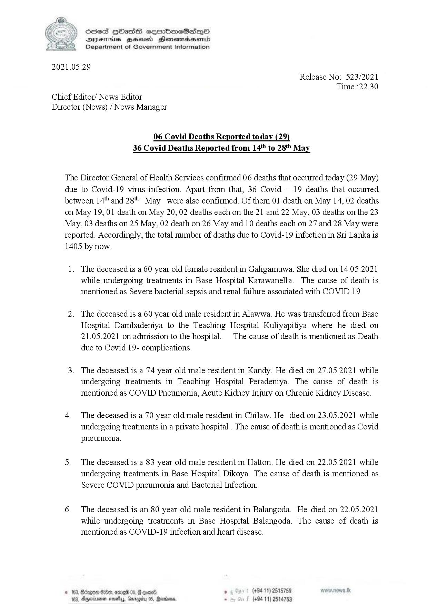

# Press Release - 2021.05.29 - Covid 19 infection deaths 
Key: c9e6f2ba0829f9c0ab07caa6e8663615 

---
```
SeS HOHasS sermimeSes—poO
SYEThis ZHsusd Henomadsemd
Department of Government Information

 

2021.05.29
Release No: 523/2021
Time :22.30
Chief Editor/ News Editor
Director (News) / News Manager

06 Covid Deaths Reported today (29)
36 Covid Deaths Reported from 14" to 28" May

The Director General of Health Services confirmed 06 deaths that occurred today (29 May)
due to Covid-19 virus infection. Apart from that, 36 Covid — 19 deaths that occurred
between 14" and 28 May were also confirmed. Of them 01 death on May 14, 02 deaths
on May 19, 01 death on May 20, 02 deaths each on the 21 and 22 May, 03 deaths on the 23
May, 03 deaths on 25 May, 02 death on 26 May and 10 deaths each on 27 and 28 May were
teported. Accordingly, the total number of deaths due to Covid-19 infection in Sri Lanka is
1405 by now.

1. The deceased is a 60 year old female resident in Galigamuwa. She died on 14.05.2021
while undergoing treatments in Base Hospital Karawanella. The cause of death is
mentioned as Severe bacterial sepsis and renal failure associated with COVID 19

2. The deceased is a 60 year old male resident in Alawwa. He was transferred from Base
Hospital Dambadeniya to the Teaching Hospital Kuliyapitiya where he died on
21.05.2021 on admission to the hospital. The cause of death is mentioned as Death
due to Covid 19- complications.

3. The deceased is a 74 year old male resident in Kandy. He died on 27.05.2021 while
undergoing treatments in Teaching Hospital Peradeniya. The cause of death is
mentioned as COVID Pneumonia, Acute Kidney Injury on Chronic Kidney Disease.

4. The deceased is a 70 year old male resident in Chilaw. He died on 23.05.2021 while
undergoing treatments in a private hospital . The cause of death is mentioned as Covid
pneumonia.

5. The deceased is a 83 year old male resident in Hatton. He died on 22.05.2021 while
undergoing treatments in Base Hospital Dikoya. The cause of death is mentioned as
Severe COVID pneumonia and Bacterial Infection.

6. The deceased is an 80 year old male resident in Balangoda. He died on 22.05.2021
while undergoing treatments in Base Hospital Balangoda. The cause of death is
mentioned as COVID-19 infection and heart disease.

= ‘ (+94 11) 2515759
Aryeinionen ; . (+94 11) 2514753

 

```
