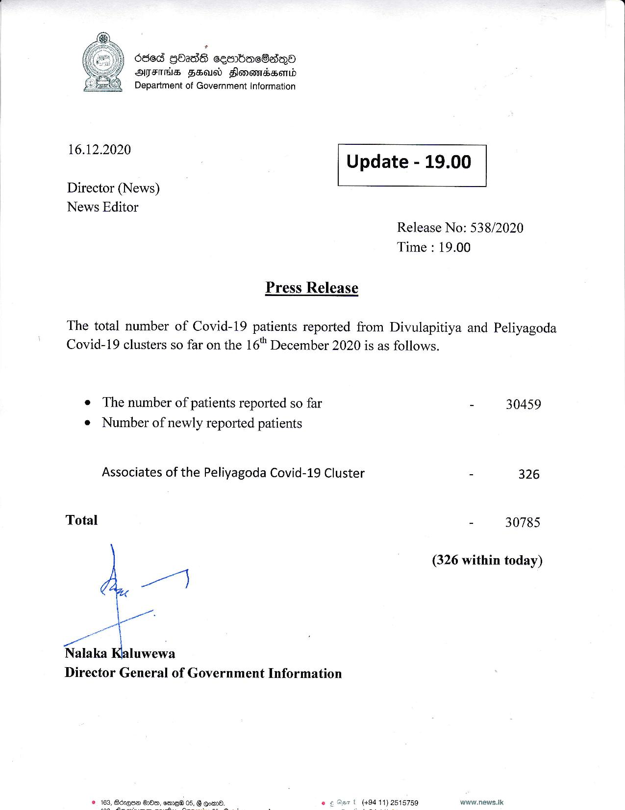

# Press Release - 2020.12.16 - 326 Covid 19 infection patients has been reported 
Key: ca31fac4b1f8bccf4892610dd8991ff7 

---
```
.
66d GOass ceembacSadqoO
AFH FEU Slonomasasertd
Department of Government Information

 

 

16.12.2020 Update - 19.00

 

 

 

Director (News)

News Editor
Release No: 538/2020
Time : 19.00

Press Release

The total number of Covid-19 patients reported from Divulapitiya and Peliyagoda
Covid-19 clusters so far on the 16 December 2020 is as follows.

e The number of patients reported so far - 30459
¢ Number of newly reported patients

Associates of the Peliyagoda Covid-19 Cluster - 326
Total - 30785
(326 within today)

ataka aon

Director General of Government Information

 

t (494 11) 2515759 www.news.tk

 

oid.

```
