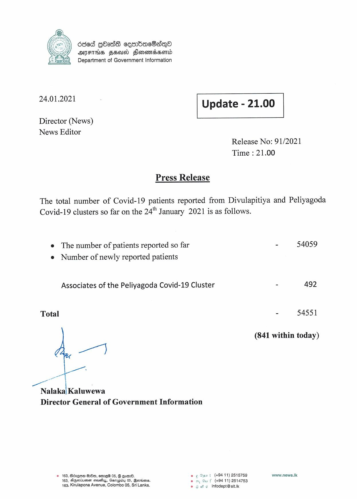

# Press Release - 2021.01.24 
Key: ca544d3d2a26db53b155aa290721a5c6 

---
```
ded gOass sesrbaeBasqQo
AITIHS SEU Flomomassortd
Department of Government Information

 

 

24.01.2021 Update - 21.00

 

 

 

Director (News)

News Editor
Release No: 91/2021
Time : 21.00

Press Release

The total number of Covid-19 patients reported from Divulapitiya and Peliyagoda
Covid-19 clusters so far on the 24" January 2021 is as follows.

e The number of patients reported so far - 54059
e Number of newly reported patients

Associates of the Peliyagoda Covid-19 Cluster - 492

Total - 54551

(841 within today)

wa)

ae}

Nalaka| Kaluwewa
Director General of Government Information

© 163, Béxqoe 200, etre 05, § om. © ¢ Osnt (+9411) 2515759 www.news.lk
163, Dearie arsuehus, Gamepidy 05, Beriens. 1 f (49411) 2514753
463, Kirulapona Avenue, Colombo 05, Sri Lanka. © se infodept@stt.ik

 

```
