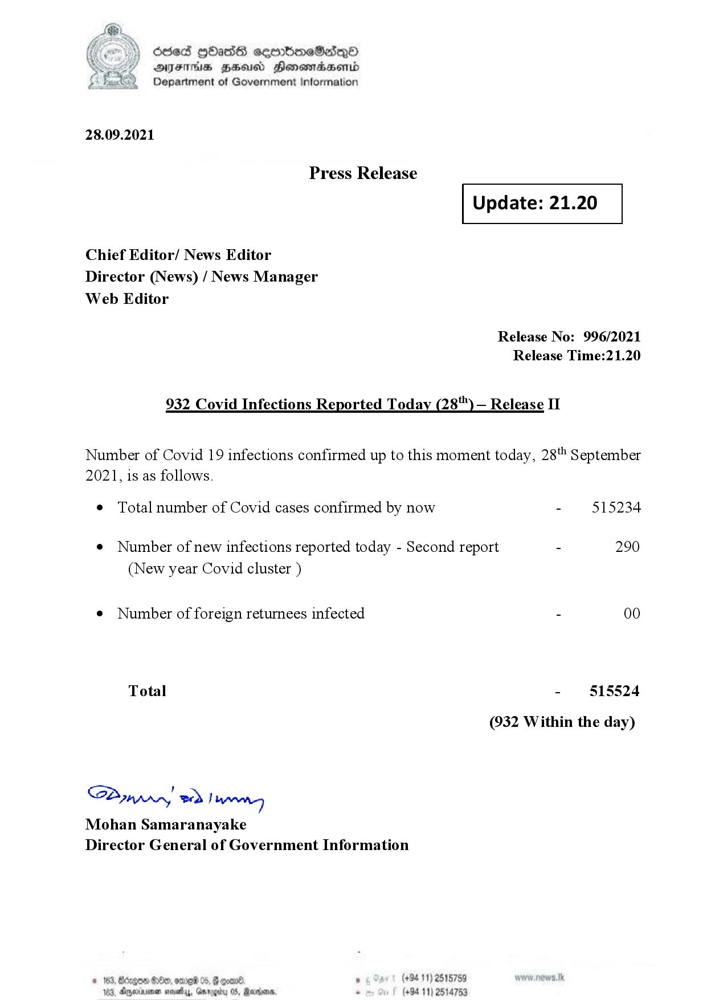

# Press Release  - 2021.09.28 - Covid 19 Infection Report 
Key: cb09562d1b16222e257d3683a63312c3 

---
```
dosed GOass eemmbmeSadepO
DFS BHU Honswnradasentd
Department of Government Information

 

 

28.09.2021

Press Release

Chief Editor/ News Editor
Director (News) / News Manager
Web Editor

 

 

Update: 21.20

 

 

Release No: 996/2021
Release Time:21.20

932 Covid Infections Reported Today (28) — Release II

Number of Covid 19 infections confirmed up to this moment today, 28" September

2021, is as follows.

¢ Total number of Covid cases confirmed by now

¢ Number of new infections reported today - Second report

(New year Covid cluster )

¢ Number of foreign returnees infected

Total

Saar eed } hang
Mohan Samaranayake
Director General of Government Information

© 163,

 

0eb, 019 05, 6 eon®. ° (+94 11) 2518759
163, Ageia sasty, Garogiy 05, Ravana - (+94 11) 2514753

- 515234

290

- 815524
(932 Within the day)

```
