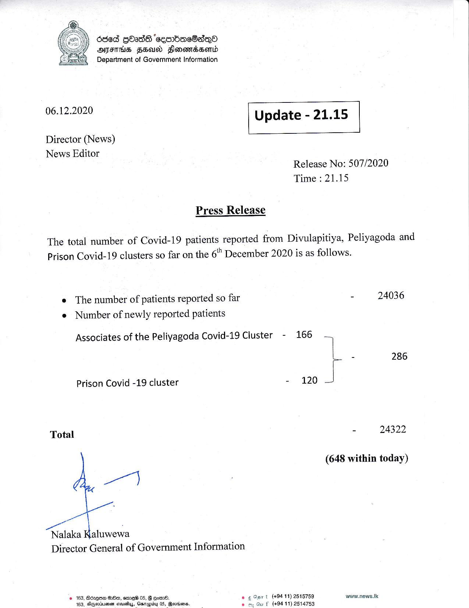

# Press Release - 2020.12.06 
Key: cb3b8f5e308a171bc7db1352e5c47a19 

---
```
686d GOads ‘eeenbeaeSaqQo
AIFS HEAD SlenewmbHonld
Department of Government Information

 

 

06.12.2020 Update -21.15

 

 

 

Director (News)

News Editor
Release No: 507/2020
Time : 21.15

Press Release

The total number of Covid-19 patients reported from Divulapitiya, Peliyagoda and
Prison Covid-19 clusters so far on the 6" December 2020 is as follows.

e The number of patients reported so far - 24036
e Number of newly reported patients

Associates of the Peliyagoda Covid-19 Cluster - 166 —

ro - 286
Prison Covid -19 cluster - 120 J
Total - 24322
(648 within today)
Go
Nalaka Kaluwewa
Director General of Government Information
© 163, Sdugee Oe, sme® 05, § gow. e ¢ Gant (+9411) 2515759 www.news.tk

163, Blgeviuanen ctousyy, Garapiby 05, Geveisnss fe oy Ou f (494 11) 2514753

```
