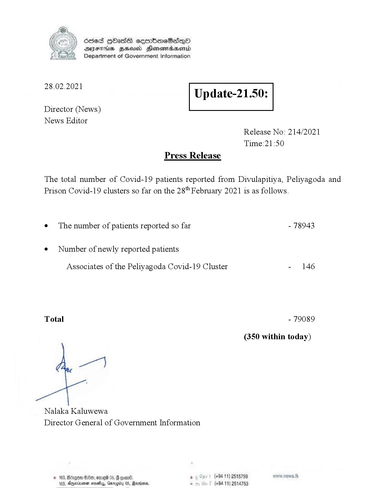

# Press Release - 2021.02.28 
Key: cbef7da8d600bef72eb43741fe526079 

---
```
Ssed HbasG sembmeSadqo
DAIS BHU Honomasentd
Department of Government Information

 

 

28.02.2021

Update-21.50:

 

 

 

Director (News)
News Editor
Release No: 214/2021
Time:21:50
Press Release

The total number of Covid-19 patients reported from Divulapitiya, Peliyagoda and
Prison Covid-19 clusters so far on the 28" February 2021 is as follows.
e¢ The number of patients reported so far - 78943

¢ Number of newly reported patients

Associates of the Peliyagoda Covid-19 Cluster - 146

Total - 79089

(350 within today)

ge]

Nalaka Kaluwewa
Director General of Government Information

© 163, Regen G00, ome 05, # come , (+94 11) 2515789
183. Agywinvmen ose, Garoeity 0S, Sardar . (+94 11) 2514753

```
