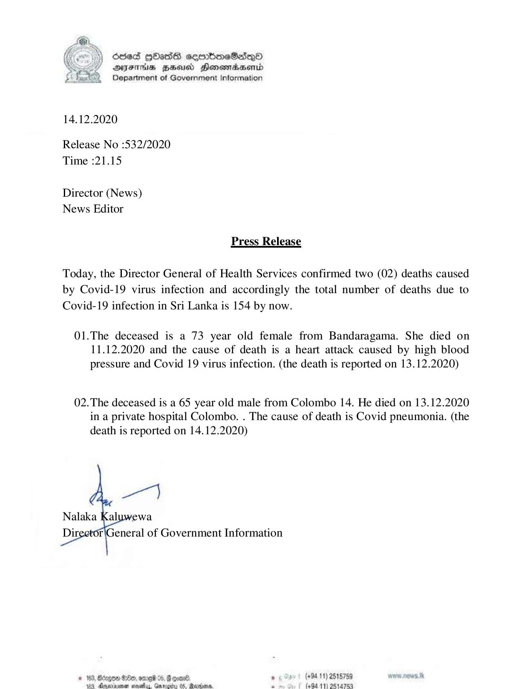

# Press Release - 2020.12.14 - Covid 19 infection deaths rises to 154 
Key: cc225b1b2d6547d84c9bbcf16b97c7e0 

---
```
6865 HHasG sembomcSsqQoO
DFTs HHusd Hensmabsenid
Department of Government Information

 

14.12.2020

Release No :532/2020
Time :21.15

Director (News)
News Editor

Press Release

Today, the Director General of Health Services confirmed two (02) deaths caused
by Covid-19 virus infection and accordingly the total number of deaths due to
Covid-19 infection in Sri Lanka is 154 by now.

01.The deceased is a 73 year old female from Bandaragama. She died on
11.12.2020 and the cause of death is a heart attack caused by high blood
pressure and Covid 19 virus infection. (the death is reported on 13.12.2020)

02.The deceased is a 65 year old male from Colombo 14. He died on 13.12.2020
in a private hospital Colombo. . The cause of death is Covid pneumonia. (the
death is reported on 14.12.2020)

 

. (+84 11) 2515759
(094 11) 2514753

 

```
