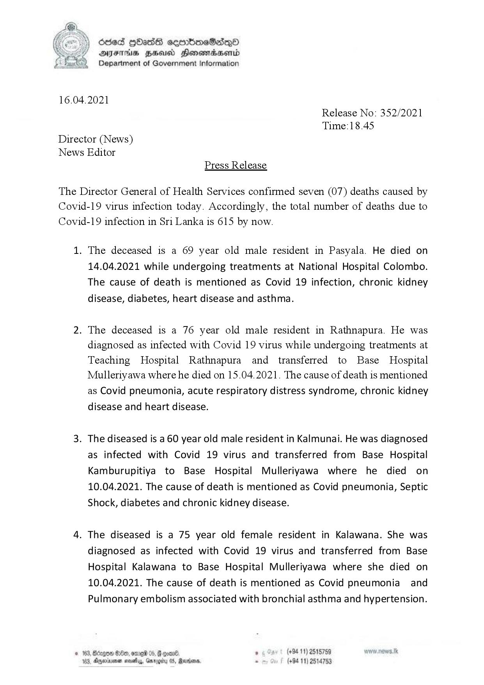

# Press Release - 2021.04.16 - Covid 19 infection deaths 
Key: cd9685e545effec4f9c849d6623c7592 

---
```
ddeS [bas cemrbioeSadQo
AIFS HHUd SHonemadaHenrd
Department of Government Information

 

16.04.2021
Release No: 352/2021
Time:18.45
Director (News)
News Editor
Press Release

The Director General of Health Services confirmed seven (07) deaths caused by
Covid-19 virus infection today. Accordingly, the total number of deaths due to
Covid-19 infection in Sri Lanka is 615 by now.

1. The deceased is a 69 year old male resident in Pasyala. He died on
14.04.2021 while undergoing treatments at National Hospital Colombo.
The cause of death is mentioned as Covid 19 infection, chronic kidney
disease, diabetes, heart disease and asthma.

2. The deceased is a 76 year old male resident in Rathnapura. He was
diagnosed as infected with Covid 19 virus while undergoing treatments at
Teaching Hospital Rathnapura and transferred to Base Hospital
Mulleriyawa where he died on 15.04.2021. The cause of death is mentioned
as Covid pneumonia, acute respiratory distress syndrome, chronic kidney
disease and heart disease.

3. The diseased is a 60 year old male resident in Kalmunai. He was diagnosed
as infected with Covid 19 virus and transferred from Base Hospital
Kamburupitiya to Base Hospital Mulleriyawa where he died on
10.04.2021. The cause of death is mentioned as Covid pneumonia, Septic
Shock, diabetes and chronic kidney disease.

4. The diseased is a 75 year old female resident in Kalawana. She was
diagnosed as infected with Covid 19 virus and transferred from Base
Hospital Kalawana to Base Hospital Mulleriyawa where she died on
10.04.2021. The cause of death is mentioned as Covid pneumonia and
Pulmonary embolism associated with bronchial asthma and hypertension.

on . (+94 11) 2515759

© 183, Bérgom #00, ome 05, @ eoar®
05, Maroon, . (+94 11) 2514753

183, Ayminuenen noes, Garou

 

```
