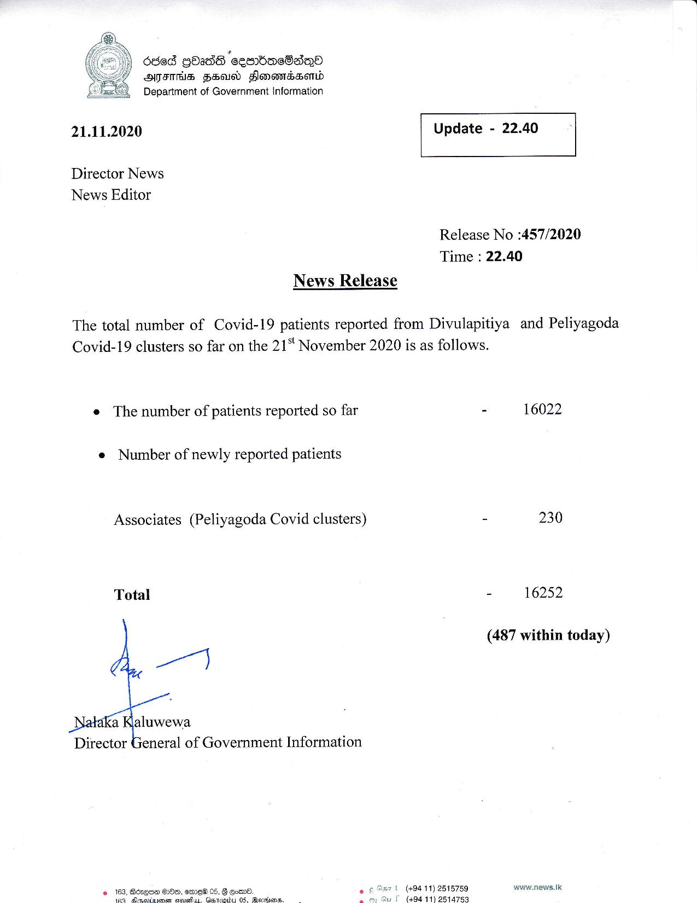

# Press Release - 2020.11.21 
Key: cd98561ab1b3f40ba692ab464760e0c1 

---
```
dde8 gbads ‘eeobneSaiQO
ATITHS FEU Flomomassomd
Department of Government Information

 

 

21.11.2020 Update - 22.40

 

 

 

Director News
News Editor

Release No :457/2020
Time : 22.40

News Release

The total number of Covid-19 patients reported from Divulapitiya and Peliyagoda
Covid-19 clusters so far on the 21‘ November 2020 is as follows.

e The number of patients reported so far - 16022

e Number of newly reported patients

 

Associates (Peliyagoda Covid clusters) - 230
Total - 16252
(487 within today)
_Nataka Kaluwewa
Director General of Government Information
© 163, Bézqne HDe, emew 05, F goad. { (494 11) 2515759 www.news.Ik

    

“is Mimcantaaaaer dai atta) DS. Meceene: { (494 11) 2514753

```
