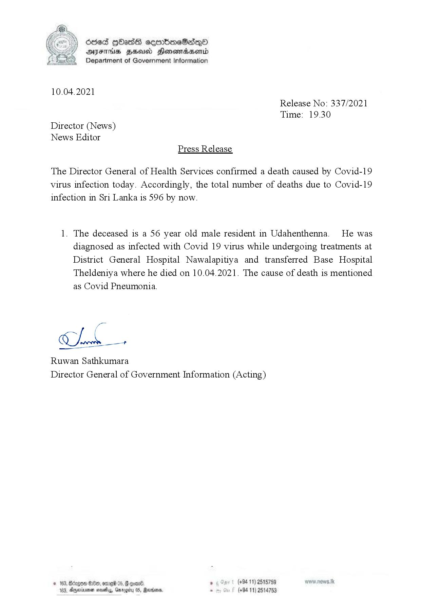

# Press Release - 2021.04.10 - Covid 19 Infection deaths 
Key: cdacff49ccaecd861d6c20ba0e9aaf8b 

---
```
  

ddeS [bas cemrbioeSadQo
AIFS HHUd SHonemadaHenrd
> Department of Government Information

10.04.2021
Release No: 337/2021
Time: 19.30
Director (News)
News Editor
Press Release

The Director General of Health Services confirmed a death caused by Covid-19
virus infection today. Accordingly, the total number of deaths due to Covid-19
infection in Sri Lanka is 596 by now.

1. The deceased is a 56 year old male resident in Udahenthenna. He was
diagnosed as infected with Covid 19 virus while undergoing treatments at
District General Hospital Nawalapitiya and transferred Base Hospital
Theldeniya where he died on 10.04.2021. The cause of death is mentioned
as Covid Pneumonia.

luk

Ruwan Sathkumara
Director General of Government Information (Acting)

© 163, Bécge &0eo, ore 05, @ eoa0®. ‘ (+94.11) 2515759
163, Agerruna sasety, Gnrggiy 05, Ravens, - (+94 11) 2514753

```
