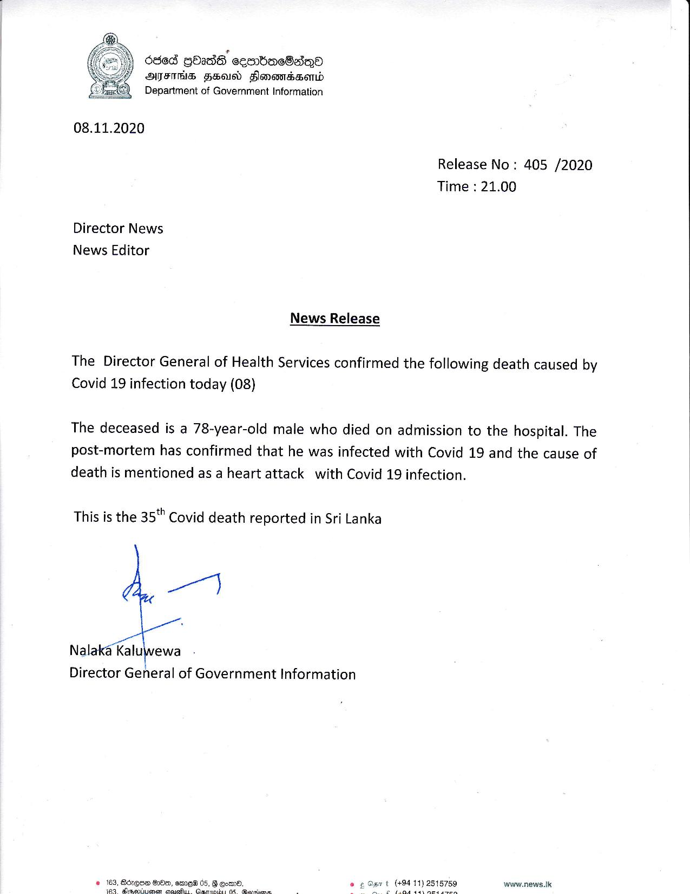

# Press Release - 2020.11.08 - The 35th Covid death reported in Sri Lankaa 
Key: cf0f0e198b9f898e50325cad33e908ef 

---
```
   

636d GOI cenbacOGsdqQo
YF AMIS FGOId FlononsHend
Department of Government Information

08.11.2020

Release No: 405 /2020
Time : 21.00

Director News
News Editor
News Release

The Director General of Health Services confirmed the following death caused by
Covid 19 infection today (08)

The deceased is a 78-year-old male who died on admission to the hospital. The
post-mortem has confirmed that he was infected with Covid 19 and the cause of

death is mentioned as a heart attack with Covid 19 infection.

This is the 35" Covid death reported in Sri Lanka

et

Nalaka Kaluwewa
Director General of Government Information

 

srt (49411)

 

www.news.Ik

   

 

```
