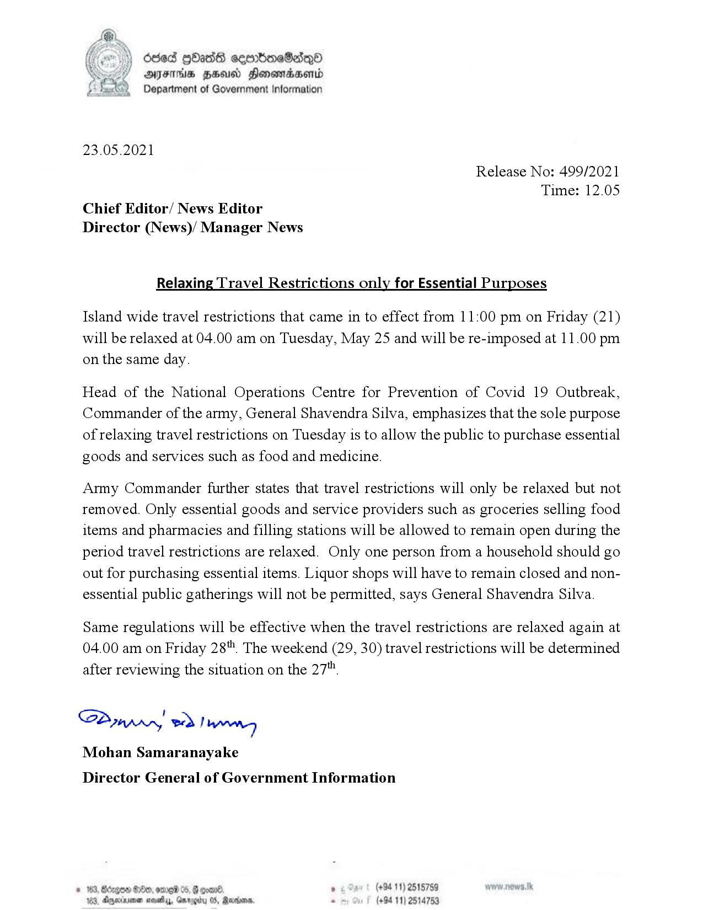

# Press Release - 2021.05.23 - Relaxing Travel Restrictions only for Essential Purposes 
Key: d039767e55193bac3e5e732d25029a74 

---
```
(oe) Oded GOa88 ceortioeSadn®
Y AYES ZHU Honomaasend
Department of Government Information

 

23.05.2021

Release No: 499/2021
Time: 12.05
Chief Editor/ News Editor
Director (News)/ Manager News

Relaxing Travel Restrictions only for Essential Purposes

Island wide travel restrictions that came in to effect from 11:00 pm on Friday (21)
will be relaxed at 04.00 am on Tuesday, May 25 and will be re-imposed at 11.00 pm
on the same day.

Head of the National Operations Centre for Prevention of Covid 19 Outbreak,
Commander of the army, General Shavendra Silva, emphasizes that the sole purpose
of relaxing travel restrictions on Tuesday is to allow the public to purchase essential
goods and services such as food and medicine.

Army Commander further states that travel restrictions will only be relaxed but not
removed. Only essential goods and service providers such as groceries selling food
items and pharmacies and filling stations will be allowed to remain open during the
period travel restrictions are relaxed. Only one person from a household should go
out for purchasing essential items. Liquor shops will have to remain closed and non-
essential public gatherings will not be permitted, says General Shavendra Silva.

Same regulations will be effective when the travel restrictions are relaxed again at
04.00 am on Friday 28". The weekend (29, 30) travel restrictions will be determined
after reviewing the situation on the 27".

S2mrrn Thang
Mohan Samaranayake

Director General of Government Information

° (+94 11) 25157!
(+94 11) 25

© 163, 190 05, @
103, gjerinionen maith, Gnrogit

       

```
