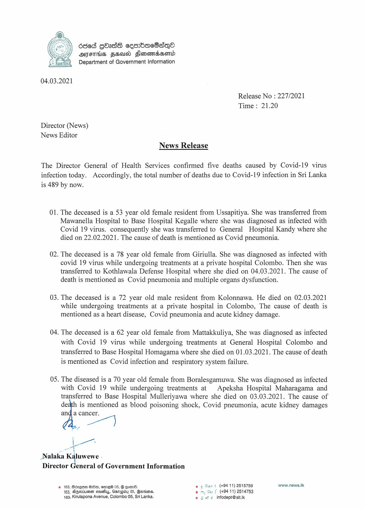

# Press Release - 2021.03.04 - Covid 19 infection deaths 
Key: d0ae6b79b15deb75b2313915ae00c6f0 

---
```
6568 GOasdS cesrbacSsqQo
OMSIHS FEU Flonomedsomd
Department of Government Information

 

04.03.2021

Release No : 227/2021
Time: 21.20

Director (News)
News Editor

News Release

The Director General of Health Services confirmed five deaths caused by Covid-19 virus
infection today. Accordingly, the total number of deaths due to Covid-19 infection in Sri Lanka
is 489 by now.

01. The deceased is a 53 year old female resident from Ussapitiya. She was transferred from
Mawanella Hospital to Base Hospital Kegalle where she was diagnosed as infected with
Covid 19 virus. consequently she was transferred to General Hospital Kandy where she
died on 22.02.2021. The cause of death is mentioned as Covid pneumonia.

02. The deceased is a 78 year old female from Giriulla. She was diagnosed as infected with
covid 19 virus while undergoing treatments at a private hospital Colombo. Then she was
transferred to Kothlawala Defense Hospital where she died on 04.03.2021. The cause of
death is mentioned as Covid pneumonia and multiple organs dysfunction.

03. The deceased is a 72 year old male resident from Kolonnawa. He died on 02.03.2021
while undergoing treatments at a private hospital in Colombo, The cause of death is
mentioned as a heart disease, Covid pneumonia and acute kidney damage.

04. The deceased is a 62 year old female from Mattakkuliya, She was diagnosed as infected
with Covid 19 virus while undergoing treatments at General Hospital Colombo and
transferred to Base Hospital Homagama where she died on 01.03.2021. The cause of death
is mentioned as Covid infection and respiratory system failure.

05. The diseased is a 70 year old female from Boralesgamuwa. She was diagnosed as infected
with Covid 19 while undergoing treatments at | Apeksha Hospital Maharagama and
transferred to Base Hospital Mulleriyawa where she died on 03.03.2021. The cause of

death is mentioned as blood poisoning shock, Covid pneumonia, acute kidney damages
ang a cancer.

Les
ae

-
_Nalaka Kaluwewe
Director General of Government Information

© 163, BdzqEe GrH0, eemew 05, G Eom. fe © Sant (+94 11) 2515759 www.news.Ik
163, SGoriuee seus, Gsmepisy 05, Govrions. om, Gu f (+9411) 2514753
163, Kirulapona Avenue, Colombo 05, Sri Lanka. © 9 He infodept@sit.Ik

 

 

```
