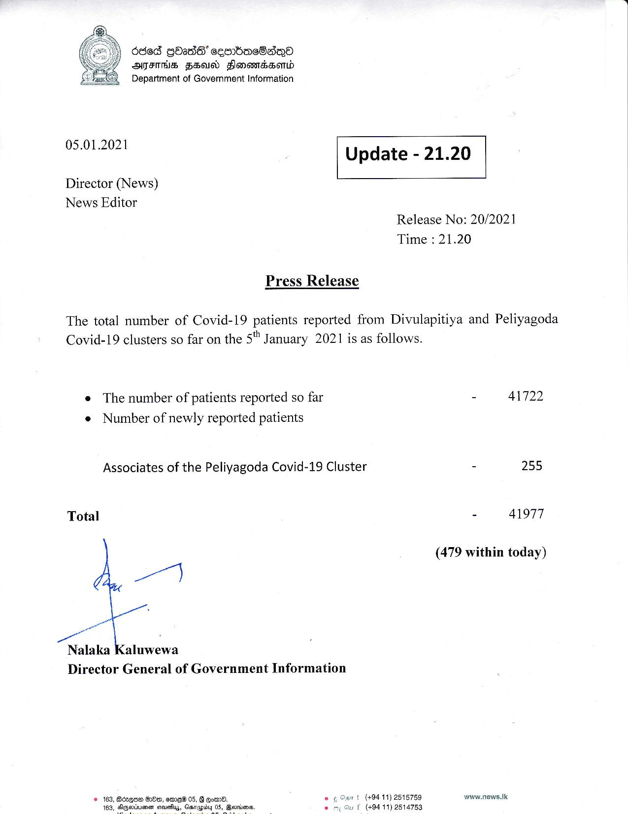

# Press Release - 2021.01.05 
Key: d113e50b4a803a9d7bdf712cc84cd2d8 

---
```
6868 GbOse’ cembaeSaoa
ATFITHS FEU FlonenssonLd
Department of Government Information

 

 

05.01.2021

 

Update - 21.20

 

 

Director (News)
News Editor

Release No: 20/2021
Time : 21.20

Press Release

The total number of Covid-19 patients reported from Divulapitiya and Peliyagoda

Covid-19 clusters so far on the 5" January 2021 is as follows.

e The number of patients reported so far
e Number of newly reported patients

Associates of the Peliyagoda Covid-19 Cluster

Total

a

Nalaka Kaluwewa
Director General of Government Information

1 (494 11) 2515759

© 163, Borque HH, eemeW 05, G @oem©. eg Oe
B . f (494 11) 2514753

163, Alygeoiuienan eveflyy, Gastapibyy

   

- 41722

- 255

- 41977

(479 within today)

waww.news.lk

```
