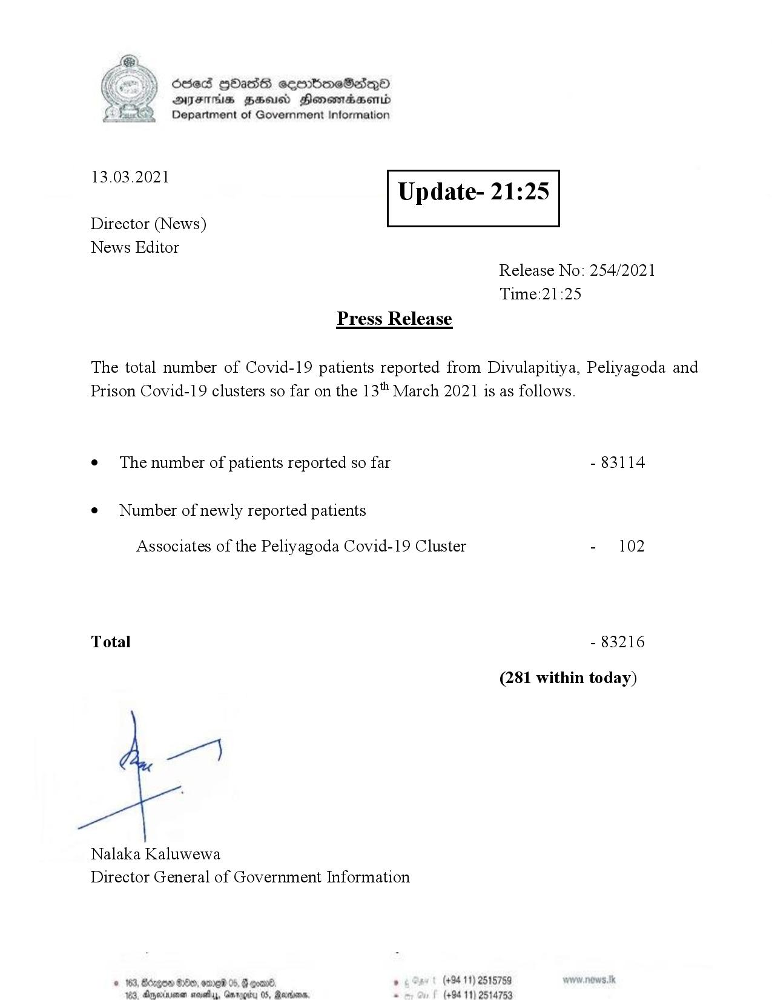

# Press Release - 2021.03.13 
Key: d271bacd8605154c35911fe6aefab228 

---
```
Ssed HbasG sembmeSadqo
DAIS BHU Honomasentd
Department of Government Information

 

 

13.03.2021

Update- 21:25

 

 

 

Director (News)
News Editor
Release No: 254/2021
Time:21:25
Press Release

The total number of Covid-19 patients reported from Divulapitiya, Peliyagoda and
Prison Covid-19 clusters so far on the 13" March 2021 is as follows.
e¢ The number of patients reported so far - 83114

¢ Number of newly reported patients

Associates of the Peliyagoda Covid-19 Cluster - 102

Total - 83216

(281 within today)

per}

Nalaka Kaluwewa
Director General of Government Information

© 163, Bizgon 0, omre 05, # gone , (+94 11) 2515789
aaclis, Oniccéu (5, Same: . (494 11) 2514759

 

```
