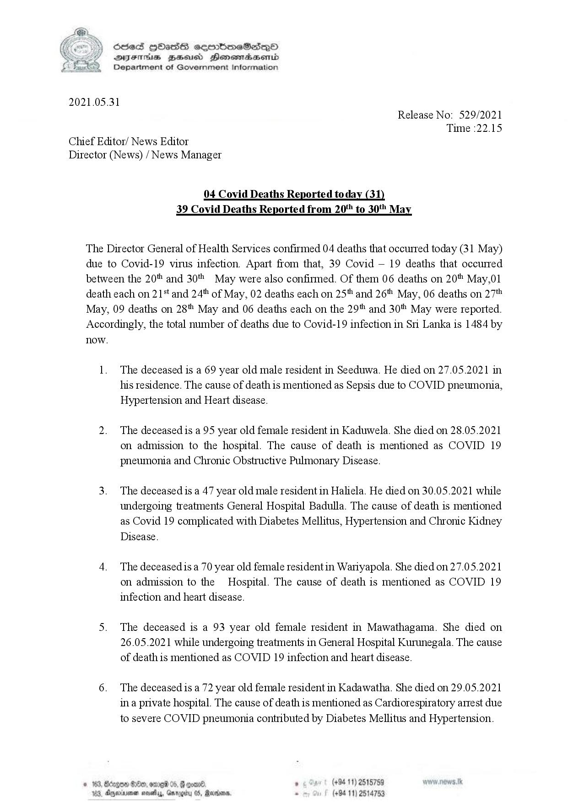

# Press Release - 2021.05.31 - Covid 19 infection deaths 
Key: d282cad020d04b5c3e459f554d89f435 

---
```
SseS Hbas semmimeSicsep©O

 

=x

2021.05.31

SVsTMs BZeeud Hensoadasond

Jepartment of Government Information

Release No: 529/2021
Time :22.15

Chief Editor/ News Editor
Director (News) / News Manager

04 Covid Deaths Reported today (31)
39 Covid Deaths Reported from 20" to 30 May

The Director General of Health Services confirmed 04 deaths that occurred today (31 May)

due to

Covid-19 virus infection. Apart from that, 39 Covid — 19 deaths that occurred

between the 20" and 30" May were also confirmed. Of them 06 deaths on 20% May,01
death each on 21% and 24" of May, 02 deaths each on 25 and 26" May, 06 deaths on 27"
May, 09 deaths on 28 May and 06 deaths each on the 29" and 30" May were reported.
Accordingly, the total number of deaths due to Covid-19 infection in Sri Lanka is 1484 by

now.

  

The deceased is a 69 year old male resident in Seeduwa. He died on 27.05.2021 in
his residence. The cause of death is mentioned as Sepsis due to COVID pneumonia,
Hypertension and Heart disease.

The deceased is a 95 year old female resident in Kaduwela. She died on 28.05.2021
on admission to the hospital. The cause of death is mentioned as COVID 19
pneumonia and Chronic Obstructive Pulmonary Disease.

The deceased is a 47 year old male resident in Haliela. He died on 30.05.2021 while
undergoing treatments General Hospital Badulla. The cause of death is mentioned
as Covid 19 complicated with Diabetes Mellitus, Hypertension and Chronic Kidney
Disease.

The deceased is a 70 year old female resident in Wariyapola. She died on 27.05.2021
on admission to the Hospital. The cause of death is mentioned as COVID 19
infection and heart disease.

The deceased is a 93 year old female resident in Mawathagama. She died on
26.05.2021 while undergoing treatments in General Hospital Kurunegala. The cause
of death is mentioned as COVID 19 infection and heart disease.

The deceased is a 72 year old female resident in Kadawatha. She died on 29.05.2021
ina private hospital. The cause of death is mentioned as Cardiorespiratory arrest due
to severe COVID pneumonia contributed by Diabetes Mellitus and Hypertension.

   
  

6 . (+94 11) 2515759
Barns, . (+94 11) 2514753

Oo, ome 0
noutyy, Gari

```
