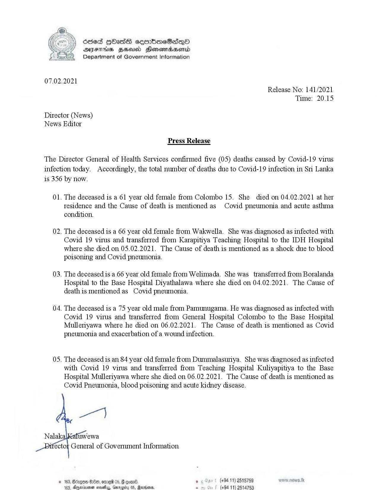

# Press Release - 2021.02.07 - Covid 19 infection deaths 
Key: d2a964ea323d815c34f47d13ae090f43 

---
```
68ed HOass semimeSadqoO
AIFS BHU Honswmiadsertd
Department of Government Information

 

07.02.2021
Release No: 141/2021
Time: 20.15

Director (News)
News Editor

Press Release

The Director General of Health Services confirmed five (05) deaths caused by Covid-19 virus
infection today. Accordingly, the total number of deaths due to Covid-19 infection in Sri Lanka
is 356 by now.

01. The deceased is a 61 year old female from Colombo 15. She died on 04.02.2021 at her
tesidence and the Cause of death is mentioned as Covid pneumonia and acute asthma
condition.

02. The deceased is a 66 year old female from Wakwella. She was diagnosed as infected with
Covid 19 virus and transferred from Karapitiya Teaching Hospital to the IDH Hospital
where she died on 05.02.2021. The Cause of death is mentioned as a shock due to blood
poisoning and Covid pneumonia.

03. The deceased is a 66 year old female from Welimada. She was transferred from Boralanda
Hospital to the Base Hospital Diyathalawa where she died on 04.02.2021. The Cause of
death is mentioned as Covid pneumonia.

04. The deceased is a 75 year old male from Pamunugama. He was diagnosed as infected with
Covid 19 virus and transferred from General Hospital Colombo to the Base Hospital
Mulleriyawa where he died on 06.02.2021. The Cause of death is mentioned as Covid
pneumonia and exacerbation of a wound infection.

05. The deceased is an 84 year old female from Dummalasuriya. She was diagnosed as infected
with Covid 19 virus and transferred from Teaching Hospital Kuliyapitiya to the Base
Hospital Mullertyawa where she died on 06.02.2021. The Cause of death is mentioned as
Covid Pneumonia, blood poisoning and acute kidney disease.

 

° (+94 11) 2515789 ws.

© 163, Bdegow #000
3 (+94 11) 2514753

sat daasenivenen a

    

```
