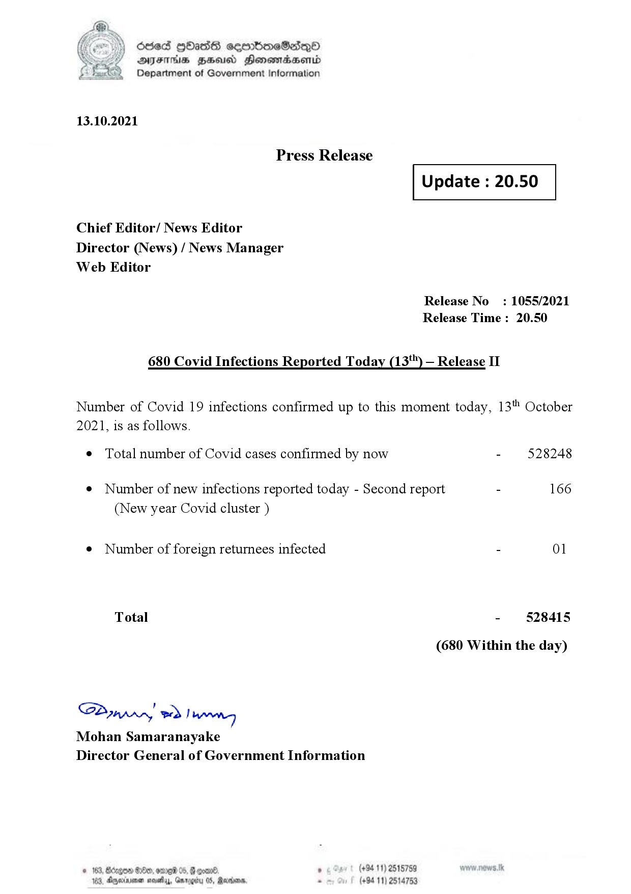

# Press Release - 2021.10.13 
Key: d43133c966a87580da85e5dabdc89267 

---
```
dosed GOass eemmbmeSadepO
DFS BHU Honswnradasentd
Department of Government Information

 

 

13.10.2021

Press Release

Chief Editor/ News Editor
Director (News) / News Manager
Web Editor

 

 

Update : 20.50

 

 

Release No

: 1055/2021

Release Time : 20.50

680 Covid Infections Reported Today (13*") — Release II

Number of Covid 19 infections confirmed up to this moment today, 13" October

2021, is as follows.

¢ Total number of Covid cases confirmed by now

¢ Number of new infections reported today - Second report -

(New year Covid cluster )

¢ Number of foreign returnees infected

Total

SP nprrn wd Ianwng
Mohan Samaranayake
Director General of Government Information

 

. (+94 11) 2515759
(+94 11) 2514753

528248

166

01

528415

(680 Within the day)

```
