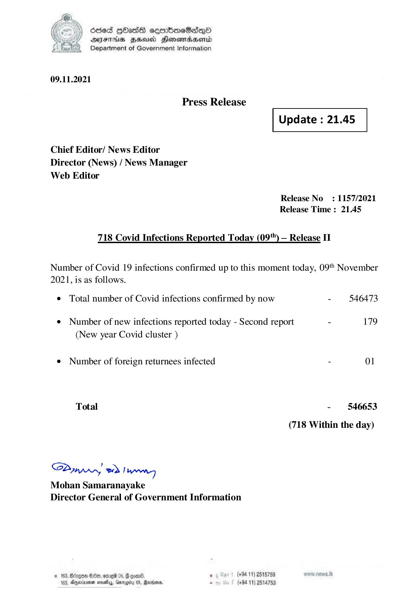

# Press Release - 2021.11.0 - Covid 19 Infection Report 
Key: d5282c5f34a47edc1f654476201f0808 

---
```
(2) sed QOadsE eeerboeB2dqQo
/ DAIFTHS HHA Henowadsentd
Department of Government Information

 

09.11.2021

Press Release

 

Update : 21.45

 

 

 

Chief Editor/ News Editor
Director (News) / News Manager
Web Editor

Release No: 1157/2021
Release Time : 21.45

718 Covid Infections Reported Today (09") — Release II

Number of Covid 19 infections confirmed up to this moment today, 09" November
2021, is as follows.

¢ Total number of Covid infections confirmed by now - 546473
¢ Number of new infections reported today - Second report - 179
(New year Covid cluster )
¢ Number of foreign returnees infected - 01
Total - 546653
(718 Within the day)

Saar eed Joanng
Mohan Samaranayake
Director General of Government Information

© 163, Beizgoe S00, ore 05, # goane ° (#94 11) 2518789
163, Aparna seseiy, Gnrogiry 05, Ravens, - (+94 11) 2514753

```
