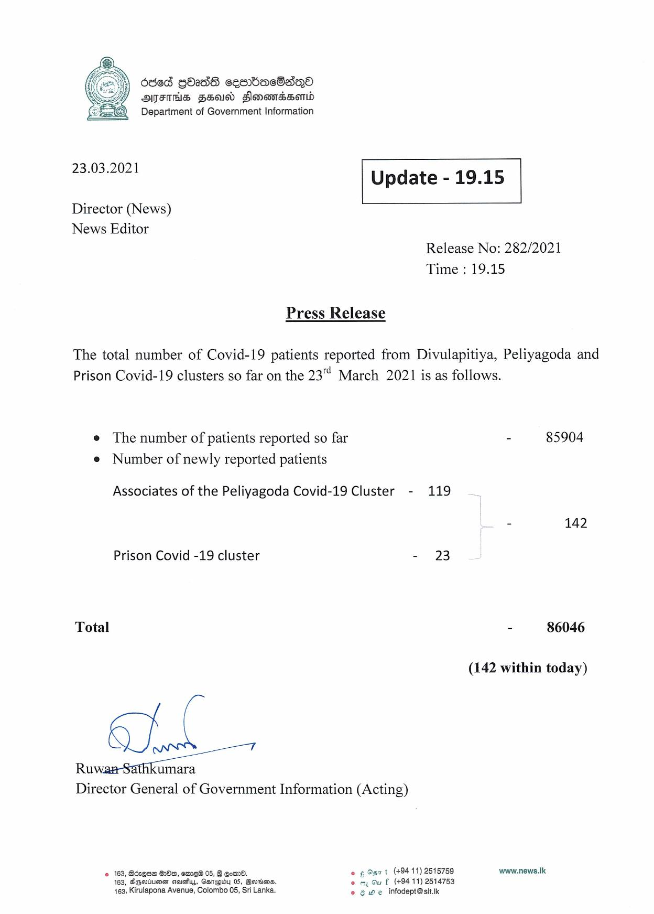

# Press Release - 2021.03.23 
Key: d58ace365871e958bd9f3a87a8469b11 

---
```
 

Department of Government Information

 

23.03.2021 Update - 19.15

 

 

 

Director (News)
News Editor

Release No: 282/2021
Time : 19.15

Press Release

The total number of Covid-19 patients reported from Divulapitiya, Peliyagoda and
Prison Covid-19 clusters so far on the 23 March 2021 is as follows.

e The number of patients reported so far - 85904
e Number of newly reported patients

Associates of the Peliyagoda Covid-19 Cluster - 119

e 142

Prison Covid -19 cluster = 23)

Total

cm:

Director General of Government Information (Acting)

- 86046

(142 within today)

© 163, Bdzque GO, sme® 05, § @omd. © ¢ Ost (+9411) 2515759 www.news.Ik
163, SGwisums seuss, Garepiby 05, Bevriims. © my Gu f (+9411) 2514753
163, Kirulapona Avenue, Colombo 05, Sri Lanka. © 6 we infodept@stt.ik

```
