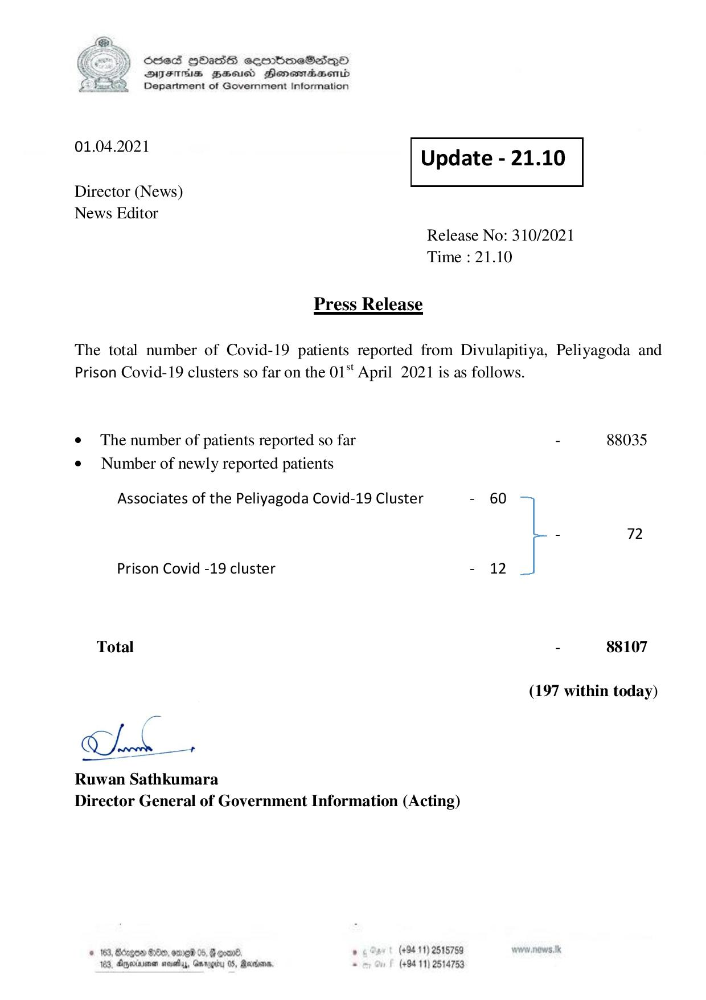

# Press Release - 2021.04.01 
Key: d58f8bcae0662c8f0f2c1507d6965c89 

---
```
) ScdeS HOadS cermbmeSsdQo
DVEFIHS HHosd Honomabsenid
Department of Government Information

 

 

01.04.2021 Update - 21.10

 

 

 

Director (News)

News Editor
Release No: 310/2021
Time : 21.10

Press Release

The total number of Covid-19 patients reported from Divulapitiya, Peliyagoda and
Prison Covid-19 clusters so far on the 01" April 2021 is as follows.

e The number of patients reported so far - 88035
¢ Number of newly reported patients
Associates of the Peliyagoda Covid-19 Cluster - 60
- 72
Prison Covid -19 cluster - 12
Total - 88107
(197 within today)

Pa

hd +

Ruwan Sathkumara
Director General of Government Information (Acting)

© 163, Bdrgon He, ome 05, G qomn0, . (+94 11) 2515789
183, Ageia sesthy,, Garngity 0S, Rarvara - (+94 11) 2514753

```
