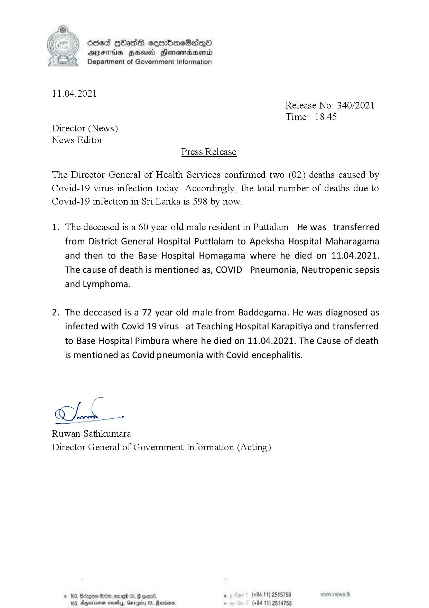

# Press Release - 2021.04.11 - Covid 19 infection deaths 
Key: d6ac32f3bfb3a5227918cf746703441b 

---
```
  

6863 GOHass ceembimeSaqQo
AIFS HHUd SHonemadaHenrd
> Department of Government Information

11.04.2021
Release No: 340/2021
Time: 18.45
Director (News)
News Editor
Press Release

The Director General of Health Services confirmed two (02) deaths caused by
Covid-19 virus infection today. Accordingly, the total number of deaths due to
Covid-19 infection in Sri Lanka is 598 by now.

1. The deceased is a 60 year old male resident in Puttalam. He was transferred
from District General Hospital Puttlalam to Apeksha Hospital Maharagama
and then to the Base Hospital Homagama where he died on 11.04.2021.
The cause of death is mentioned as, COVID Pneumonia, Neutropenic sepsis
and Lymphoma.

2. The deceased is a 72 year old male from Baddegama. He was diagnosed as
infected with Covid 19 virus at Teaching Hospital Karapitiya and transferred
to Base Hospital Pimbura where he died on 11.04.2021. The Cause of death
is mentioned as Covid pneumonia with Covid encephalitis.

hb

Ruwan Sathkumara
Director General of Government Information (Acting)

© 163, Borgo Oe, ome 05, @ goon . (+94 11) 2515759
123, Anyminenen noalay, Garogity 05, Manders . (+94 11) 2514753

```
