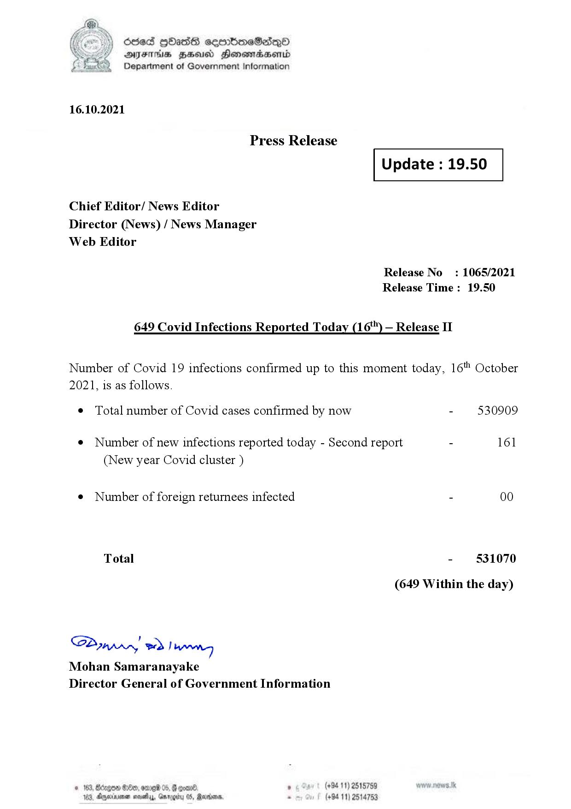

# Press Release - 2021.10.16 - Covid 19 Infection Report 
Key: d6e2630a1ce48b401c14344f6eb51b0d 

---
```
dosed GOass eemmbmeSadepO
DFS BHU Honswnradasentd
Department of Government Information

 

 

16.10.2021

Press Release

Chief Editor/ News Editor
Director (News) / News Manager
Web Editor

 

 

Update : 19.50

 

 

Release No

Release Time :

649 Covid Infections Reported Today (16*") — Release II

: 1065/2021
19.50

Number of Covid 19 infections confirmed up to this moment today, 16" October

2021, is as follows.

¢ Total number of Covid cases confirmed by now

¢ Number of new infections reported today - Second report -

(New year Covid cluster )

¢ Number of foreign returnees infected

Total

SP nprrn wd Ianwng
Mohan Samaranayake
Director General of Government Information

 

. (+94 11) 2515759
(+94 11) 2514753

530909

161

00

531070

(649 Within the day)

```
