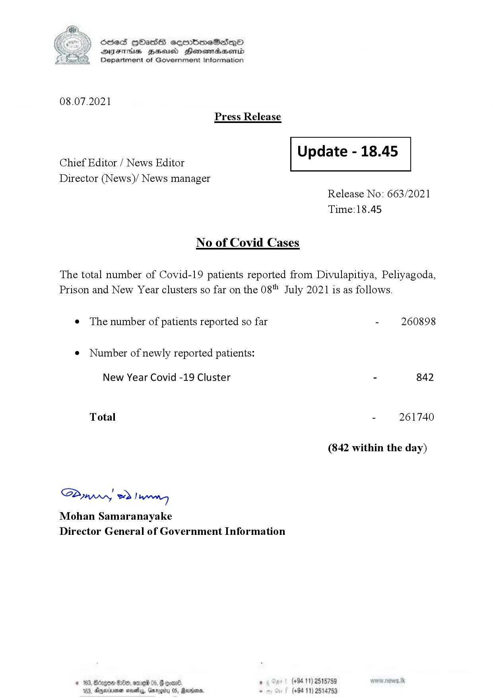

# Press Release - 2021.07.08 
Key: d713e84a28eb6d0e488ff76f1b9f45b6 

---
```
S) ScseS HOasdS cerrbmeSdQo
DFTs BHEosd Henewtaeasernid
Department of Government Information

 

08.07.2021
Press Release

 

Update - 18.45

 

 

Chief Editor / News Editor
Director (News)/ News manager

 

Release No: 663/2021
Time:18.45

No of Covid Cases

The total number of Covid-19 patients reported from Divulapitiya, Peliyagoda,
Prison and New Year clusters so far on the 08" July 2021 is as follows.

e The number of patients reported so far - 260898

¢ Number of newly reported patients:

New Year Covid -19 Cluster - 842
Total - 261740
(842 within the day)

Saw 2) wn
Mohan Samaranayake
Director General of Government Information

$20, ome 06, 8 goav8. , (+94 11) 2515759
DAnarinoe sevety, Garogicy 05, Raden, - (+94 11) 2514753

 

```
