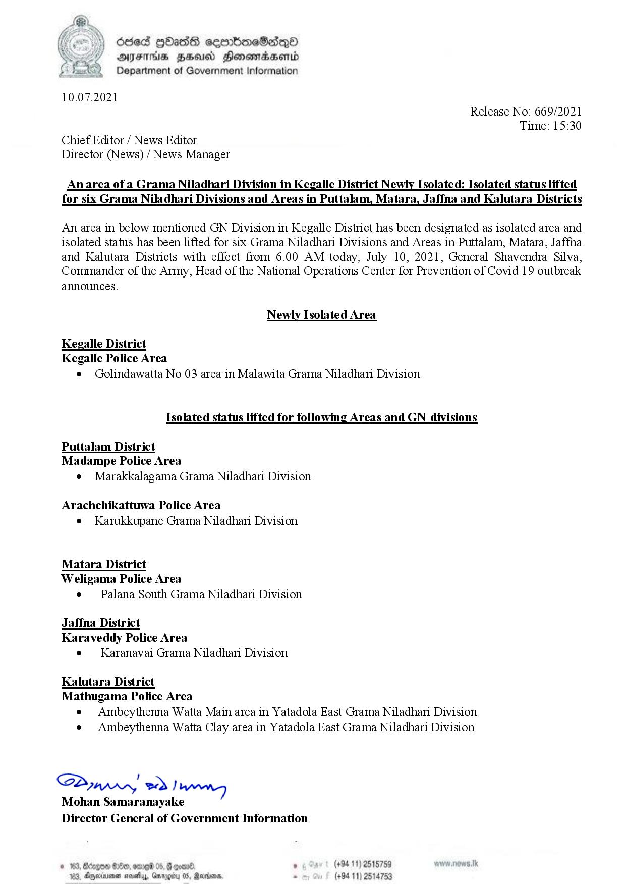

# Press Release - 2021.07.10 - Newly Isolated Areas & Isolated status lifted Areas 
Key: d7801941e76d5611d7330b77ca096b51 

---
```
GA )) Seed |Oads ceemticeSadq—0
‘ DIF HHUO HonowadaAenrd
Department of Government Information

 

10.07.2021

Release No: 669/2021

Chief Editor / News Editor
Director (News) / News Manager

Time: 15:30

An area of a Grama Niladhari Division in Kegalle District Newly Isolated: Isolated status lifted

 

for six Grama Niladhari Divisions and Areas in Puttalam, Matara, Jaffna and Kalutara Districts

 

An area in below mentioned GN Division in Kegalle District has been designated as isolated area and
isolated status has been lifted for six Grama Niladhari Divisions and Areas in Puttalam, Matara, Jaffna
and Kalutara Districts with effect from 6.00 AM today, July 10, 2021, General Shavendra Silva,
Commander of the Army, Head of the National Operations Center for Prevention of Covid 19 outbreak

announces.

Newly Isolated Area

Kegalle District
Kegalle Police Area

¢ Golindawatta No 03 area in Malawita Grama Niladhari Division

Isolated status lifted for following Areas and GN divisions

Puttalam District
Madampe Police Area
e Marakkalagama Grama Niladhari Division

Arachchikattuwa Police Area
e Karukkupane Grama Niladhari Division

Matara District
Weligama Police Area
e — Palana South Grama Niladhari Division

Jaffna District
Karaveddy Police Area
e Karanavai Grama Niladhari Division.

Kalutara District

Mathugama Police Area
e Ambeythenna Watta Main area in Yatadola East Grama Niladhan Division
e Ambeythenna Watta Clay area in Yatadola East Grama Niladhari Division

!
Slyw.,, ed Iuwn
Mohan Samaranayake
Director General of Government Information

. (+94 11) 2515759
(+94 11) 2514753

 

```
