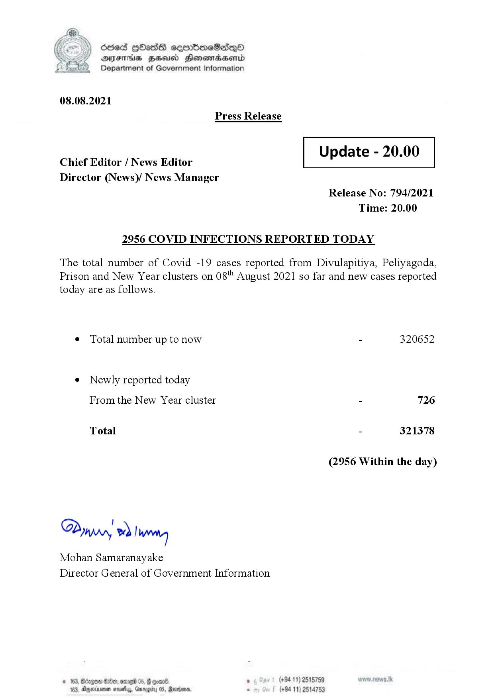

# Press Release  - 2021.08 .08 - Covid 19 Infection Report 
Key: d7f54826fbc7439e215a15db9165208a 

---
```
) Sled HOAsdS ceorbmeSdQo
DFS HHS Hensrradaentd
Department of Government Information

 

08.08.2021

Press Release

Chief Editor / News Editor
Director (News)/ News Manager

2956 COVID INFECTIONS RE

 

Update - 20.00

 

 

 

Release No: 794/2021
Time: 20.00

PORTED TODAY

The total number of Covid -19 cases reported from Divulapitiya, Peliyagoda,
Prison and New Year clusters on 08" August 2021 so far and new cases reported

today are as follows.

¢ Total number up to now
e Newly reported today
From the New Year cluster

Total

Din, ~) IWoreteg

Mohan Samaranayake
Director General of Government Information

 

- 320652

- 726
- 321378

(2956 Within the day)

. (+94 11) 2515759

(+94 11) 2514753

```
