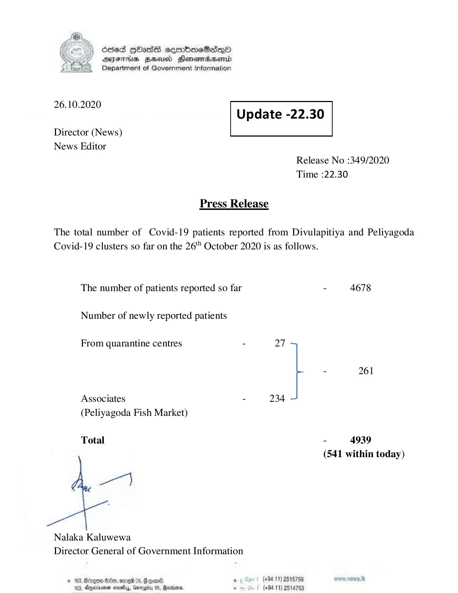

# Press Release - 2020.10.26 
Key: d81fbd8a630a1942fd7a58f4d9084566 

---
```
6563 HOHasG sembmcSasqQo
DAJFITAs BHU Honomrdbsertd
Department of Government Information

 

 

26.10.2020
Update -22.30

 

 

Director (News)
News Editor

 

Release No :349/2020
Time :22.30

Press Release

The total number of Covid-19 patients reported from Divulapitiya and Peliyagoda
Covid-19 clusters so far on the 26" October 2020 is as follows.

The number of patients reported so far - 4678

Number of newly reported patients

From quarantine centres - 27
- 261
Associates - 234
(Peliyagoda Fish Market)
Total - 4939

(541 within today)

7}

Nalaka Kaluwewa
Director General of Government Information

# 169, Bcegem 80, ore 04, Foal , (494.11) 2515759 MOREE
163, Ageia sve, Grrogby 05, Maxson, * (+9411) 2514753

```
