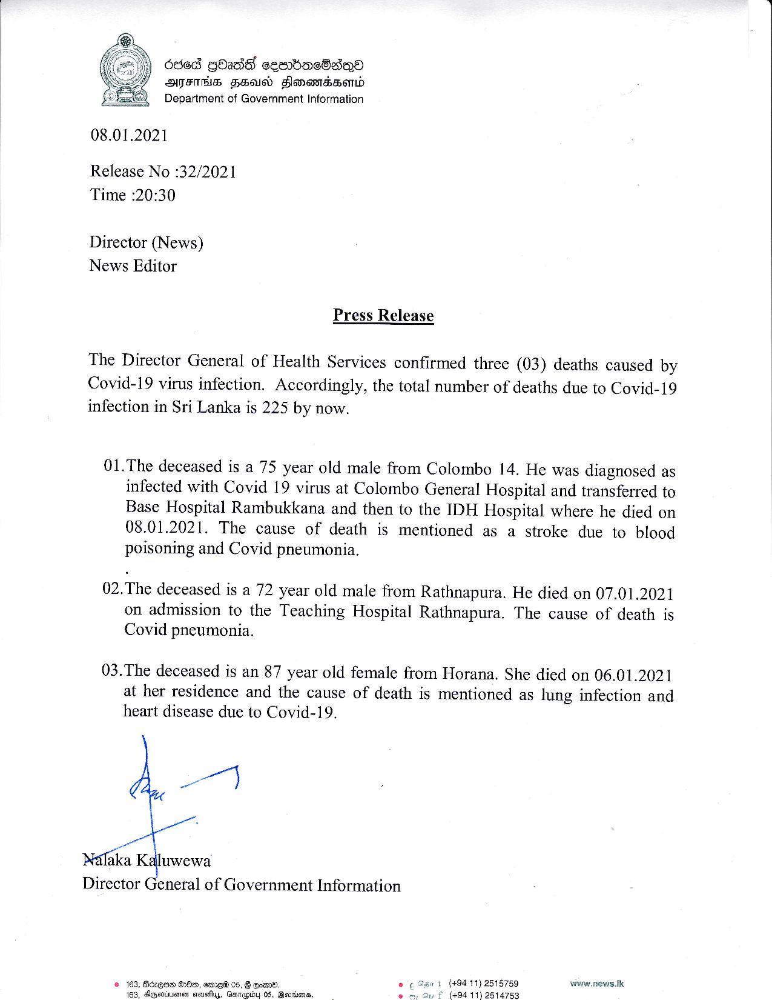

# Press Release - 2021.01.08 - 3 Covid 19 deaths has been reported, total number of deaths rises to 225 
Key: d87ddee06d44f5a73d2c22b70a66e490 

---
```
Oded GOadE cemmBacOadeo
AIFS FHA Flonamdssomd
Department of Government Information

 

08.01.2021

Release No :32/2021
Time :20:30

Director (News)
News Editor

Press Release

The Director General of Health Services confirmed three (03) deaths caused by
Covid-19 virus infection. Accordingly, the total number of deaths due to Covid-19
infection in Sri Lanka is 225 by now.

01.The deceased is a 75 year old male from Colombo 14. He was diagnosed as
infected with Covid 19 virus at Colombo General Hospital and transferred to
Base Hospital Rambukkana and then to the IDH Hospital where he died on
08.01.2021. The cause of death is mentioned as a stroke due to blood
poisoning and Covid pneumonia.

02.The deceased is a 72 year old male from Rathnapura. He died on 07.01.2021
on admission to the Teaching Hospital Rathnapura. The cause of death is
Covid pneumonia.

03.The deceased is an 87 year old female from Horana. She died on 06.01.2021
at her residence and the cause of death is mentioned as lung infection and
heart disease due to Covid-19.

wry

Néfaka Kaluwewa
Director General of Government Information

Joa t (494 11) 2515759 waww.news.lic
f (494 11) 2514753

  

© 163, Bcvqae G00, ema® 05, B qoww8.
163, Akgeviusnen sroustiuy, Gestuptby 05, Berisens. le

 

 

```
